# React

* React is a JavaScript library for building user interfaces.

* React allows us to create reusable UI components.

* It was developed by Facebook and is often used for creating single-page applications (SPAs) and mobile applications.

* React is known for its efficiency and flexibility in managing the UI of web applications.

`Define UI`

The User Interface (UI) is the point of human-computer interaction and communication in a device. UI encompasses all the visual and interactive elements through which users interact with software, websites, applications, and devices to perform tasks, access information, or achieve specific goals.

`There are two primary types of user interfaces:`

`Graphical User Interface (GUI):` GUI is the most common type of user interface and is characterized by graphical elements such as icons, buttons, windows, and menus. Users interact with GUIs by using input devices like a mouse, keyboard, or touch screen. Operating systems like Windows, macOS, and most mobile apps use GUIs.

`Command Line Interface (CLI):` CLI is a text-based user interface where users interact with a program or system by typing commands in a terminal or console. It is commonly used by developers, system administrators, and power users for tasks that require precise control and automation. Popular CLI environments include the Windows Command Prompt, macOS Terminal, and various Linux shells.


#  what is React?

* ReactJS is an open-source JavaScript library used to create user interfaces in a declarative and efficient way. 

* It was developed by Facebook and is widely used for creating interactive and dynamic web applications. 

* It is a component-based front-end library responsible only for the view layer of a Model View Controller(MVC) architecture. 

* React is used to create modular user interfaces and promotes the development of reusable UI components that display dynamic data.


`Why React?`

* Created and Maintained By facebook.

* It has a huge community in github.

* Component Based architecture.

* Efficient Virtual DOM, declarative syntax, reusability, rich ecosystem

* Offers performance optimization, JSX, and wide adoption, making it a top choice for dynamic web applications.

## How does React works?

* React works by creating a virtual representation of the UI called the Virtual DOM in memory.

* Instead of manipulating the browser's DOM directly, React creates a virtual DOM in memory, where it does all the necessary manipulating, before making the changes in the browser DOM.

* When state changes occur, React efficiently calculates the minimal changes needed, updates the Virtual DOM, and then synchronizes these changes with the real DOM.

* React only changes what needs to be changed!

* React finds out what changes have been made, and changes only what needs to be changed.

## React.js History

* Current version of React.JS is V18.0.0 (April 2022).

* Initial Release to the Public (V0.3.0) was in July 2013.

* React.JS was first used in 2011 for Facebook's Newsfeed feature.

* Facebook Software Engineer, Jordan Walke, created it.

* Current version of create-react-app is v5.0.1 (April 2022).

* create-react-app includes built tools such as webpack, Babel, and ESLint.

# React Features

* `Component-Based Architecture:` Building UIs using reusable and self-contained components for easier development and maintenance.

* `Virtual DOM:` Efficiently updates the actual DOM by minimizing direct manipulations, resulting in better performance.

* `Declarative Syntax:` Describes UI based on state, making it easier to manage and understand.

* `Unidirectional Data Flow:` Ensures predictable updates by flowing data in one direction.

* `JSX:` Embeds HTML-like syntax within JavaScript for intuitive UI representation.

* `Component Lifecycle:` Allows control over component creation, update, and destruction.

* `State and Props:` Manages component-specific and passed data for dynamic UIs.

* `Hooks:` Offers state and lifecycle functionalities to functional components.

* `Context API:`Facilitates state sharing across components without prop drilling.

* `Ecosystem:` Rich collection of libraries and tools for diverse functionalities.

* `License:` React is licensed under the Facebook Inc. Documentation is licensed under CC BY 4.0.

## React Advantages

•	Component-Based Architecture

•	Virtual DOM

•	Declarative Syntax

•	One-Way Data Flow

•	Rich Ecosystem

•	Community and Support

•	Cross-Platform Development (with React Native)

•	SEO-Friendly (with SSR and Next.js)


## React Limitations

•	Learning Curve

•	Boilerplate Code

•	Tooling Complexity

•	Frequent Updates

•	Performance Overhead

•	Unopinionated

•	Lack of Built-in State Management

•	UI Focus (may require additional libraries for non-UI features)


`Prerequisites for React?`

1: Basic Knowledge of Html , css and Javascript.

2: Basic Understanding of ES6 Features.

3: Basic Understanding of how to use npm(Node Package Manager).


# React JS Environment Setup

To run any React application, we need to first setup a ReactJS Development Environment.

`Pre-requisite:` We must have NodeJS and npx installed on our PC.

`ReactJS Installation:`Using create-react-app(faster method)

`Step 1:` Navigate to the folder where you want to create the project and open it in terminal

`Step 2:` In the terminal of the application directory type the following command

```
npx create-react-app <<Application_Name>>

```


`Step 3:` Navigate to the newly created folder using the command

```
cd <<Application_Name>>

```


`Step 4:` A default application will be created with the following project structure and dependencies.

`Step 5:` To run this application type the following command in terminal.

```
npm start

```

`Step 6:` The following output will be displayed in the browser.


## React File and Folder Structure

In React application, there are several files and folders in the root directory. Some of them are as follows:

1. `node_modules:` It contains the React library and any other third party libraries needed.

2. `public:` It holds the public assets of the application. It contains the index.html where React will mount the application by default on the   
  ` <div id="root"></div>` element.

3. `src:` It contains the App.css, App.js, App.test.js, index.css, index.js, and serviceWorker.js files. Here, the App.js file always responsible for displaying the output screen in React.

4. `package-lock.json:` It is generated automatically for any operations where npm package modifies either the node_modules tree or package.json. It cannot be published. It will be ignored if it finds any other place rather than the top-level package.

5. `package.json:` It holds various metadata required for the project. It gives information to npm, which allows to identify the project as well as handle the project?s dependencies.

6. `README.md:` It provides the documentation to read about React topics.

# React ES6

`What is ES6?`

* ES6 stands for ECMAScript 6.

* ECMAScript was created to standardize JavaScript, and ES6 is the 6th version of ECMAScript, it was published in 2015, and is also known as ECMAScript 2015.

* ECMAScript is a scripting language specification that defines the core features of JavaScript, the most widely used programming language for web development. 

* ES6 introduced significant enhancements and new features to the JavaScript language, making it more powerful, expressive, and developer-friendly.

`Why should I learn ES6?`

React uses ES6, and you should be familiar with some of the new features like:

1. Classes
   
2. Arrow Functions

3. Variables (let, const, var)

4. Array Methods like .map()

5. Destructuring

6. Modules

7. Ternary Operator

8. Spread Operator

## ES6 Classes

ES6 introduced classes.

A class is a type of function, but instead of using the keyword function to initiate it, we use the keyword class, and the properties are assigned inside a constructor() method.

`Example:`

```
A simple class constructor:

class Car {
  constructor(name) {
    this.brand = name;
  }
}

```

`Example:`

```

<!DOCTYPE html>
<html>

<body>
  
<script>
class Car {
  constructor(name) {
    this.brand = name;
  }
}

const mycar = new Car("Ford");

document.write(mycar.brand);
</script>

</body>
</html>
```


`Output:`

```bash   +@output
Ford
```

>Note: The constructor function is called automatically when the object is initialized.


`Method in classes`

You can add your own methods in a class:

`Example:`

Create a method named "present":

```

<!DOCTYPE html>
<html>

<body>
  
<script>
class Car {
  constructor(name) {
    this.brand = name;
  }

  present() {
    return 'I have a ' + this.brand;
  }
}

const mycar = new Car("Ford");
document.write(mycar.present());
</script>

</body>
</html>
```

`Output:`

```bash   +@output
I have a Ford
```

As you can see in the example above, you call the method by referring to the object's method name followed by parentheses (parameters would go inside the parentheses).


`Class Inheritance`

To create a class inheritance, use the extends keyword.

A class created with a class inheritance inherits all the methods from another class:

`Example:`

Create a class named "Model" which will inherit the methods from the "Car" class:

```

<!DOCTYPE html>
<html>

<body>
  
<script>
class Car {
  constructor(name) {
    this.brand = name;
  }

  present() {
    return 'I have a ' + this.brand;
  }
}

class Model extends Car {
  constructor(name, mod) {
    super(name);
    this.model = mod;
  }  
  show() {
    return this.present() + ', it is a ' + this.model
  }
}

const mycar = new Model("Ford", "Mustang");
document.write(mycar.show());
</script>

</body>
</html>
```


`Output:`

```bash   +@output
I have a Ford, it is a Mustang
```


The super() method refers to the parent class.

By calling the super() method in the constructor method, we call the parent's constructor method and get access to the parent's properties and methods.

### ES6 Arrow Functions

* The arrow function is a new feature of ES6, introduced in ReactJS 16. It allows the developer to create a function that has lexical “this” binding and no arguments.

* Arrow functions offer a compressed and short version of a function expression and need fewer keystrokes than regular JavaScript functions from the developer and can be used as a simpler alternative to functions within class components and functional components and event handlers in React.

* Arrow functions are always anonymous, meaning there is no need to use the keyword “function” when defining them. 

* They also do not have their own this value, meaning that this inside an arrow function will refer to the one where it was created rather than where it was called from.

* The third difference between regular JavaScript functions and arrow functions is that all arguments passed into an arrow function must be pre−defined, because there is no need for them to be assigned as default values like with regular JavaScript functions.

* Arrow functions allow us to write shorter function syntax


`When to use Arrow Functions?`

1. Arrow functions are great for performance and making declarative code more readable.

2. Although they are not always the best choice, they do have some advantages that make them worth considering.

In answer to the question, When to use them?, here are some scenarios −

* When you need to bind this to a method

* When you want a method to be called on a component's props

* When you want to use a callback function


`Why Should You Use Arrow Functions in React?`

* First, they are much simpler to write and understand than traditional function expressions. This can make your code more readable and easier to debug.

* Second, arrow functions do not create a new scope, so they can be used in ReactJS without polluting the global scope.

* Finally, arrow functions can be used as arguments to other functions, which can make your code more flexible and expressive.


`Example:`

**Before without an arrow function**

```

<!DOCTYPE html>
<html>

<body>

<h1>Function</h1>

<p>This demonstrates a regular function, NOT an arrow function.</p>

<p id="demo"></p>
  
<script>
hello = function() {
  return "Hello World!";
}

document.getElementById("demo").innerHTML = hello();
</script>

</body>
</html>
```

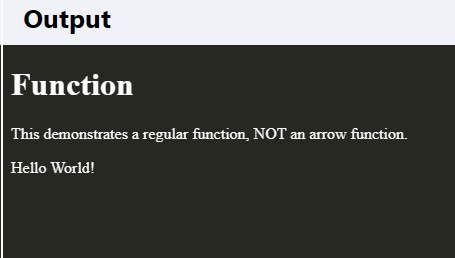


`Example:`

**With Arrow Function:**

```

<!DOCTYPE html>
<html>

<body>

<h1>Arrow Function</h1>

<p>A demonstration of a simple arrow function.</p>

<p id="demo"></p>
  
<script>
hello = () => {
  return "Hello World!";
}

document.getElementById("demo").innerHTML = hello();
</script>

</body>
</html>
```

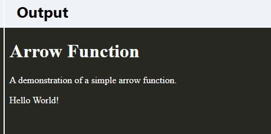


`Example: `

**Arrow Function With Parameters**

```

<!DOCTYPE html>
<html>

<body>

<h1>Arrow Function</h1>

<p>A demonstration of an arrow function in one line, with parameters.</p>

<p id="demo"></p>
  
<script>
hello = (val) => "Hello " + val;

document.getElementById("demo").innerHTML = hello("World");
</script>

</body>
</html>
```

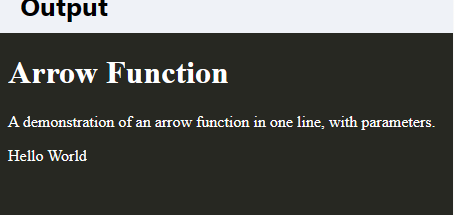

### ES6 Variable

Before ES6 there was only one way of defining your variables: with the var keyword. If you did not define them, they would be assigned to the global object. Unless you were in strict mode, then you would get an error if your variables were undefined.

Now, with ES6, there are three ways of defining your variables: var, let, and const.

>Note:
>
>* The var keyword was used in all JavaScript code from 1995 to 2015.
>
>* The let and const keywords were added to JavaScript in 2015.
>
>* The var keyword should only be used in code written for older browsers.

`Var`

* If you use var outside of a function, it belongs to the global scope.

* If you use var inside of a function, it belongs to that function.

* If you use var inside of a block, i.e. a for loop, the variable is still available outside of that block.

* var has a function scope, not a block scope.

`Example:`

```
var x = 5.6;
```


`let`

* let is the block scoped version of var, and is limited to the block (or expression) where it is defined.

* If you use let inside of a block, i.e. a for loop, the variable is only available inside of that loop.

* let has a block scope.

`Example:`

```
let x = 5.6;
```


`const`

* const is a variable that once it has been created, its value can never change.

* const has a block scope.

* The keyword const is a bit misleading.It does not define a constant value. It defines a constant reference to a value.

* Because of this you can NOT:

  * Reassign a constant value

  * Reassign a constant array

  * Reassign a constant object

* But you CAN:

  * Change the elements of constant array.

  * Change the properties of constant object.

`Example:`

```
const x = 5.6;
```

### ES6 Array Method

There are many JavaScript array methods.

* One of the most useful in React is the .map() array method.

* The .map() method allows you to run a function on each item in the array, returning a new array as the result.

* In React, map() can be used to generate lists.

`Example:`

**Generate a list of items from an array:**

```

import React from 'react';
import ReactDOM from 'react-dom/client';

const myArray = ['apple', 'banana', 'orange'];

const myList = myArray.map((item) => <p>{item}</p>)

ReactDOM.render(myList, document.getElementById('root'));

```


`Output:`

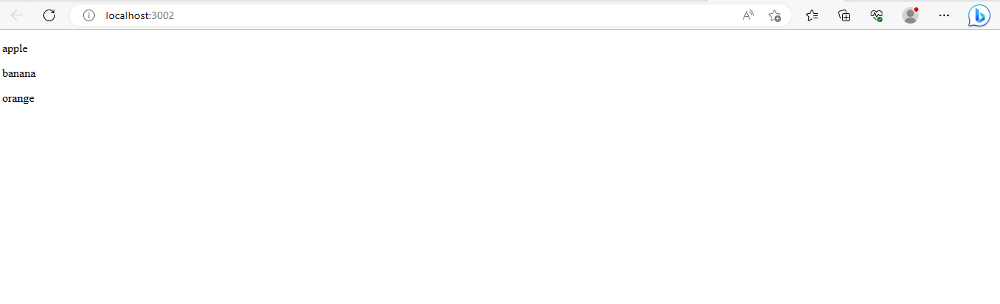


### ES6 Destructuring

* To illustrate destructuring, we'll make a sandwich. Do you take everything out of the refrigerator to make your sandwich? No, you only take out the items you would like to use on your sandwich.

* Destructuring is exactly the same. We may have an array or object that we are working with, but we only need some of the items contained in these.

* Destructuring makes it easy to extract only what is needed.

`Destructuring Arrays` 

Here is the old way of assigning array items to a variable:

`Example:`

**Before**

```
const vehicles = ['mustang', 'f-150', 'expedition'];

// old way
const car = vehicles[0];
const truck = vehicles[1];
const suv = vehicles[2];
```

`Example:`

**With Destructuring**

```
const vehicles = ['mustang', 'f-150', 'expedition'];

const [car, truck, suv] = vehicles;
```

>When destructuring arrays, the order that variables are declared is important.

`Destructuring Objects`

Here is the old way of using an object inside a function:

`Example:`

**Before**

```
const vehicleOne = {
  brand: 'Ford',
  model: 'Mustang',
  type: 'car',
  year: 2021, 
  color: 'red'
}

myVehicle(vehicleOne);

// old way
function myVehicle(vehicle) {
  const message = 'My ' + vehicle.type + ' is a ' + vehicle.color + ' ' + vehicle.brand + ' ' + vehicle.model + '.';
}
```

`Example:`

**With Destructuring**

```markdown
const vehicleOne = {
  brand: 'Ford',
  model: 'Mustang',
  type: 'car',
  year: 2021, 
  color: 'red'
}

myVehicle(vehicleOne);

function myVehicle({type, color, brand, model}) {
  const message = 'My ' + type + ' is a ' + color + ' ' + brand + ' ' + model + '.';
}
```


`Output:`

```bash  +@output
My car is a red Ford Mustang.
```


### ES6 Spread Operator

* ES6 introduced a new operator referred to as a spread operator, which consists of three dots (...). It allows an iterable to expand in places where more than zero arguments are expected. It gives us the privilege to obtain the parameters from an array.

* Spread operator syntax is similar to the rest parameter, but it is entirely opposite of it. 

Let's understand the syntax of the spread operator.

`Syntax`

```

var variablename1 = [...value];  
```
The three dots (...) in the above syntax are the spread operator, which targets the entire values in the particular variable.

`Example:`

```
<!DOCTYPE html>
<html>

<body>

<script>
const numbersOne = [1, 2, 3];
const numbersTwo = [4, 5, 6];
const numbersCombined = [...numbersOne, ...numbersTwo];

document.write(numbersCombined);
</script>

</body>
</html>
```

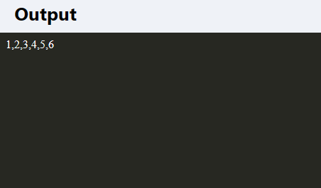

The spread operator is often used in combination with destructuring.

`Example:`

Assign the first and second items from numbers to variables and put the rest in an array:

```
<!DOCTYPE html>
<html>

<body>

<script>
const numbers = [1, 2, 3, 4, 5, 6];

const [one, two, ...rest] = numbers;

document.write("<p>" + one + "</p>");
document.write("<p>" + two + "</p>");
document.write("<p>" + rest + "</p>");
</script>

</body>
</html>
```

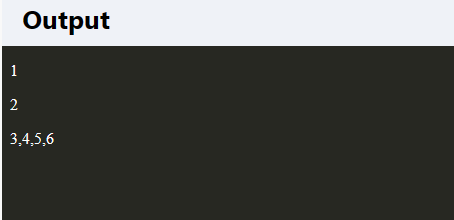


`We can use the spread operator with objects too:`

`Example:`

**Combines these Two Objects**

```
<!DOCTYPE html>
<html>

<body>

<script>
const myVehicle = {
  brand: 'Ford',
  model: 'Mustang',
  color: 'red'
}

const updateMyVehicle = {
  type: 'car',
  year: 2021, 
  color: 'yellow'
}

const myUpdatedVehicle = {...myVehicle, ...updateMyVehicle}

//Check the result object in the console:
console.log(myUpdatedVehicle);
</script>

<p>Press F12 and see the result object in the console view.</p>

</body>
</html>
```

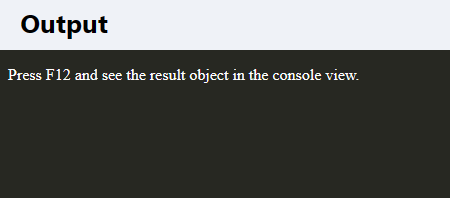

>Notice the properties that did not match were combined, but the property that did match, color, was overwritten by the last object that was passed, updateMyVehicle.

### ES6 Rest Parameter

* The rest parameter is introduced in ECMAScript 2015 or ES6, which improves the ability to handle parameters. 

* The rest parameter allows us to represent an indefinite number of arguments as an array. By using the rest parameter, a function can be called with any number of arguments.

* Before ES6, the arguments object of the function was used. The arguments object is not an instance of the Array type. Therefore, we can't use the filter() method directly.

* The rest parameter is prefixed with three dots (...). Although the syntax of the rest parameter is similar to the spread operator, it is entirely opposite from the spread operator. 

* The rest parameter has to be the last argument because it is used to collect all of the remaining elements into an array.

`Syntax`

```
function fun(a, b, ...theArgs) {  
  // statements  
}  

```

`Example`

```

function show(...args) {  
  let sum = 0;  
  for (let i of args) {  
      sum += i;  
  }  
  console.log("Sum = "+sum);  
}  
  
show(10, 20, 30);  
```

* All the arguments that we have passed in the function will map to the parameter list. As stated above, the rest parameter (...) should always be at last in the list of arguments. If we place it anywhere else, it will cause an error.

`Difference between Rest Parameter and arguments object`

The rest parameter and arguments object are different from each other. Let's see the difference between the rest parameter and the arguments object:

* The arguments object is an array-like (but not array), while the rest parameters are array instances. 

* The arguments object does not include methods such as sort, map, forEach, or pop, but these methods can be directly used in rest parameters.

`Rest Parameters and Destructuring`

* Destructuring means to break down a complex structure into simpler parts. We can define an array as the rest parameter. 

* The passed-in arguments will be broken down into the array. Rest parameter supports array destructuring only.

* By using the rest parameter, we can put all the remaining elements of an array in a new array.

Let's see an illustration of the same.

`Example`

```

var colors = ["Violet", "Indigo", "Blue", "Green", "Yellow", "Orange", "Red"];    
    
// destructuring assignment    
var [a,b,...args] = colors;    
console.log(a);     
console.log(b);     
console.log(args);  
```


`Rest Parameter in a dynamic function`

JavaScript allows us to create dynamic functions by using the function constructor. We can use the rest parameter within a dynamic function.

`Example`

```

let num = new Function('...args','return args');  
console.log(num(10, 20, 30)); 
```


### ES6 Ternary Operator

The ternary operator is a simplified conditional operator like if / else.

`Syntax:`


```
condition ? <expression if true> : <expression if false>
```

`Here is an example using if / else:`

**Before:**

```
<!DOCTYPE html>
<html>

<body>

<h1 id="demo"></h1>

<script>
function renderApp() {
  document.getElementById("demo").innerHTML = "Welcome!";
}

function renderLogin() {
  document.getElementById("demo").innerHTML = "Please log in";
}

let authenticated = true;

if (authenticated) {
  renderApp();
} else {
  renderLogin();
}

</script>

<p>Try changing the "authenticated" variable to false, and run the code to see what happens.</p>
</body>
</html>
```

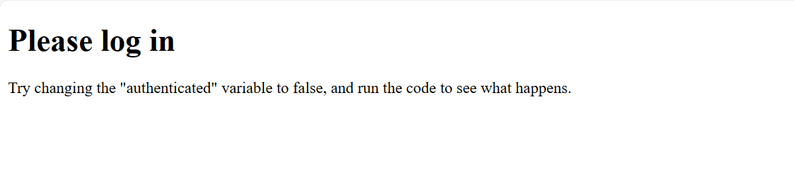

`Example with Ternary Operator:`

```
<!DOCTYPE html>
<html>

<body>

<h1 id="demo"></h1>

<script>
function renderApp() {
  document.getElementById("demo").innerHTML = "Welcome!";
}

function renderLogin() {
  document.getElementById("demo").innerHTML = "Please log in";
}

let authenticated = true;

authenticated ? renderApp() : renderLogin();

</script>

<p>Try changing the "authenticated" variable to false, and run the code to see what happens.</p>
</body>
</html>
```

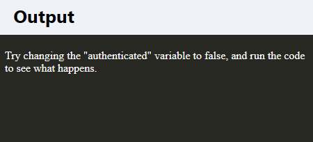

`Example Of Rendering Condition (Using Ternary Operator on React)`

`Condition.js`

```
import{useState} from 'react'

function Condition(){

    const [loggedIn , setLoggedIn] = useState(false)
    const [logIn , setLogIn] = useState(3)

    return(
        <div>
          {loggedIn?<h1>Welcome Anil</h1>:<h1>Welcome Guest</h1>}
          {logIn==1?<h1>welcome user 1</h1>:logIn==2?<h1>welcome user 2</h1>:<h1>welcome user 3</h1>}
        </div>
    )
}
export default Condition;
```

`App.js`

```markdown
import logo from './logo.svg';
import './App.css';
import Condition from './Condition'

function App() {
  return (
    <div className="App">
  <Condition />
    </div>
  );
}

export default App;
```
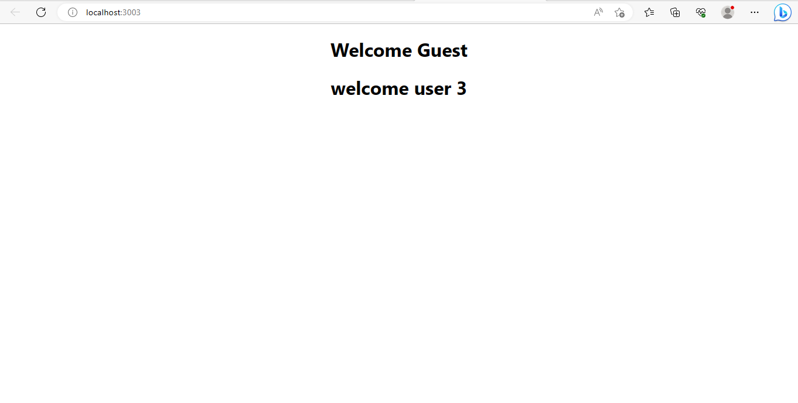

# Modify the React Application

* So far so good, but how do I change the content?

* Look in the demoapp directory, and you will find a `src` folder. Inside the src folder there is a file called `App.js`, open it and it will look like this:


Try changing the HTML content and save the file.

Notice that the changes are visible immediately after you save the file, you do not have to reload the browser!.

`Example:` Replace all the content inside the div className="App" with a h1 element.
See the changes in the browser when you click Save.

```
function App() {
  return (
    <div className="App">
      <h1>Hello World!</h1>
    </div>
  );
}
export default App;

```

`Output:`


# React Rendering Elements

* React elements are different from DOM elements as React elements are simple JavaScript objects and are efficient to create. 

* React elements are the building blocks of any React app and should not be confused with React components.

`Rendering an Element in React`

* In order to render any element into the Browser DOM, we need to have a container or root DOM element. 

* It is almost a convention to have a div element with the id=”root” or id=”app” to be used as the root DOM element. Let’s suppose our index.html file has the following statement inside it.

`<div id="root"></div>`

Now, in order to render a simple React Element to the root node, we must write the following in the App.js file.

`Example:`

`App.js`

```
import React, { Component } from 'react';

class App extends Component {

	render() {
		return (
			<div>
				<h1>Welcome All!</h1>
			</div>

		);
	}
}

export default App;


```

`Output:`


Now, you have created your first ever React Element and also have rendered it in place, but React was not developed to create static pages, the intention of using React is to create a more logical and active webpage. In order to do so, we will need to update the elements. This next section will guide us through the same.

`Updating an Element in React`

* React Elements are immutable i.e. once an element is created it is impossible to update its children or attribute. 

* Thus, in order to update an element, we must use the render() method several times to update the value over time. 

`Example:`

`App.js`

```
import React from 'react';
import ReactDOM from 'react-dom';

function App() {
  const myElement = (
    <div>
      <h1>Welcome All!</h1>
      <h2>{new Date().toLocaleTimeString()}</h2>
    </div>
  );

  ReactDOM.render(
    myElement,
    document.getElementById("root")
  );
}

setInterval(App, 1000);
export default App


```

`Output:`


In the above example, we have created a function showTime() that displays the current time, and we have set an interval of 1000ms or 1 sec that recalls the function each second thus updating the time in each call. For simplicity, we have only shown the timespan of one second in the given image.

`Important Points to Note:`

* Calling the render() method multiple times may serve our purpose for this example, but in general, it is never used instead a stateful component is used which we will cover in further articles.

* A React Element is almost never used isolated, we can use elements as the building blocks of creating a component in React.

# React Render HTML

* React's goal is in many ways to render HTML in a web page.

* React renders HTML to the web page by using a function called ReactDOM.render().

`The createRoot Function`

* The createRoot() function takes one argument, an HTML element.

* The purpose of the function is to define the HTML element where a React component should be displayed.

`The Render Function`

* The ReactDOM.render() function takes two arguments, HTML code and an HTML element.

* The purpose of the function is to display the specified HTML code inside the specified HTML element.

`But render where?`

* There is another folder in the root directory of your React project, named `"public"`. In this folder, there is an index.html file.

* You'll notice a single `<div>` in the body of this file. This is where our React application will be rendered.

`Example:`

Display a paragraph inside an element with the id of "root":

```markdown
import React from 'react';
import ReactDOM from 'react-dom/client';

ReactDOM.render(<p>Hello</p>, document.getElementById('root'));
```

`Output:`

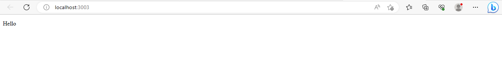

>Note: That the element id does not have to be called "root", but this is the standard convention.

`The HTML Code`

* The HTML code in this tutorial uses JSX which allows you to write HTML tags inside the JavaScript code:

* Do not worry if the syntax is unfamiliar, you will learn more about JSX in the next chapter.

`Example:`

Create a variable that contains HTML code and display it in the "root" node:

```markdown
import React from 'react';
import ReactDOM from 'react-dom/client';

const myelement = (
  <table>
    <tr>
      <th>Name</th>
    </tr>
    <tr>
      <td>John</td>
    </tr>
    <tr>
      <td>Elsa</td>
    </tr>
  </table>
);

ReactDOM.render(myelement, document.getElementById('root'));
```


`Output:`

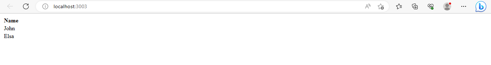

`The Root Node`

* The root node is the HTML element where you want to display the result.

* It is like a container for content managed by React.

* It does NOT have to be a `<div>` element and it does NOT have to have the id='root':

`Example:`

The root node can be called whatever you like:

```markdown
import React from 'react';
import ReactDOM from 'react-dom/client';

ReactDOM.render(<p>Hallo</p>, document.getElementById('sandy'));

/*
For this example to work on your project,
you must have a element with
id="sandy" on your "index.html" page.
*/
```

`Output:`

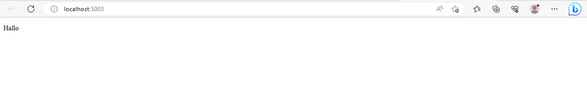

# React Jsx

* JSX stands for JavaScript XML.

* JSX is basically a syntax extension of JavaScript. 

* It helps us to write HTML in JavaScript and forms the basis of React Development.

* JSX makes it easier to write and add HTML in React.

* JSX creates an element in React that gets rendered in the UI. 

* It is transformed into JavaScript functions by the compiler at runtime.


`Jsx Syntax`

```

const ele = <h1>This is sample JSX</h1>;

```

The above code snippet somewhat looks like HTML and it also uses a JavaScript-like variable but is neither HTML nor JavaScript, it is JSX(JavaScript XML). With the help of JSX, we have directly written the HTML syntax in JavaScript.

`Expressions in JSX`

* In React we are allowed to use normal JavaScript expressions with JSX. 

* To embed any JavaScript expression in a piece of code written in JSX we will have to wrap that expression in curly braces {}. 

The below example specifies a basic use of JavaScript Expression in React.

`Example:` This example wraps the JSX code in curly braces

`App.js`

```
import React from 'react';
const App = () => {
  const name = 'Stranger';
  return (
    <div>
      <h1>Hello, {name}! Welcome to DEMO.</h1>
    </div>
  );
};
export default App;

```

`Index.js`

```
import React from 'react';
import ReactDOM from 'react-dom';
import App from './App';

ReactDOM.render(
  <React.StrictMode>
    <App />
  </React.StrictMode>,
  document.getElementById('root')
);

```

`Output:`


## Attributes in JSX

JSX allows us to use attributes with the HTML elements just like we do with normal HTML. But instead of the normal naming convention of HTML, JSX uses the camelcase convention for attributes.

`App.js`

`Example:`

```

import React from 'react';
import ReactDOM from 'react-dom';
const MyComponent = () => {
  const element = (
    <div>
      <h1 className="hello">Hello Stranger</h1>
      <h2 data-sampleAttribute="sample">This is Custom attribute</h2>
    </div>
  );
  return element;
};
export default MyComponent;
ReactDOM.render(
  <MyComponent />,
  document.getElementById("root")
);

```

`Output:`


`Specifying attribute values`

JSX allows us to specify attribute values in two ways: 

* As for string literals: We can specify the values of attributes as hard-coded strings using quotes:

```
const ele = <h1 className = "firstAttribute">Hello!</h1>;

```
* As expressions: We can specify attributes as expressions using curly braces {}: 

```
const ele = <h1 className = {varName}>Hello!</h1>;

```


## Wrapping elements or Children in JSX

Consider a situation where you want to render multiple tags at a time. To do this we need to wrap all of these tags under a parent tag and then render this parent element to the HTML. All the subtags are called child tags or children of this parent element.

`Example:` In this example we have wrapped h1, h2, and h3 tags under a single div element and rendered them to HTML:

`App.js`

```

import React from 'react';
import ReactDOM from 'react-dom';

const MyComponent = () => {
  const element = <div>
    <h1>This is Heading 1 </h1>
    <h2>This is Heading 2</h2 >
    <h3>This is Heading 3 </h3>
</div >;

  return element;
};
export default MyComponent;
ReactDOM.render(
  <MyComponent />,
  document.getElementById("root")
);

```

`Output:`


`Comments in JSX:` 

* JSX allows us to use comments as it allows us to use JavaScript expressions. 

* Comments in JSX begin with`/* and ends with */.` We can add comments by wrapping them in curly braces {} just like we did in the case of expressions.

`index.js`

```

import React from 'react';
import ReactDOM from 'react-dom';


const element = <div>
	<h1>
		Hello World !
		{/*This is a comment*/}
	</h1>
</div>;

ReactDOM.render(element, document.getElementById("root"));


```

# React Components

* A Component is one of the core building blocks of React. In other words, we can say that every application you will develop in React will be made up of pieces called components. 

* Components make the task of building UIs much easier. You can see a UI broken down into multiple individual pieces called components and work on them independently and merge them all in a parent component which will be your final UI.

**In React, we mainly have two types of components:**

`Functional Components:` Functional components are simply javascript functions. We can create a functional component in React by writing a javascript function. These functions may or may not receive data as parameters. The below example shows a valid functional component in React:

>**Note:** The name of a component should always start with a capital letter. This is done to differentiate a component tag from HTML tags.

```
function demoComponent() {
    return (<h1>
                Welcome Message!
            </h1>);
}

```
`Example:`

`App.js`

```

import React, { Component } from 'react';  
class App extends React.Component {  
   render() {  
      return (  
         <div>  
            <First/>  
            <Second/>  
         </div>  
      );  
   }  
}  
class First extends React.Component {  
   render() {  
      return (  
         <div>  
            <h1>Welcomeeee...</h1>  
         </div>  
      );  
   }  
}  
class Second extends React.Component {  
   render() {  
      return (  
         <div>  
            <h2>www.demoapp.com</h2>  
            <p>This websites contains the great Reactjs tutorial.</p>  
         </div>  
      );  
   }  
}  
export default App;

```

`Output:`


`Class Components:` The class components are a little more complex than the functional components. The functional components are not aware of the other components in your program whereas the class components can work with each other. We can pass data from one class component to another class component. We can use JavaScript ES6 classes to create class-based components in React. The below example shows a valid class-based component in React: 

```
class Democomponent extends React.Component {
    render() {
        return <h1>Welcome Message!</h1>;
    }
}

```


`Example:`
In this example, we are creating the list of unordered elements, where we will dynamically insert StudentName for every object from the data array. Here, we are using ES6 arrow syntax (=>) which looks much cleaner than the old JavaScript syntax. It helps us to create our elements with fewer lines of code. It is especially useful when we need to create a list with a lot of items.

`App.js`

```
import React, { Component } from 'react';  
class App extends React.Component {  
 constructor() {  
      super();  
      this.state = {  
         data:   
         [  
            {             
               "name":"Abhishek"             
            },  
            {            
               "name":"Saharsh"             
            },  
            {    
               "name":"Ajay"          
            }  
         ]  
      }  
   }  
   render() {  
      return (  
         <div>  
            <StudentName/>  
            <ul>            
                {this.state.data.map((item) => <List data = {item} />)}           
            </ul>  
         </div>  
      );  
   }  
}  
class StudentName extends React.Component {  
   render() {  
      return (  
         <div>  
            <h1>Student Name Detail</h1>  
         </div>  
      );  
   }  
}  
class List extends React.Component {  
   render() {  
      return (  
         <ul>            
            <li>{this.props.data.name}</li>   
         </ul>  
      );  
   }  
}  
export default App;


```

`Output:`


# React State

* The state is an updatable structure that is used to contain data or information about the component. 

* The state in a component can change over time. The change in state over time can happen as a response to user action or system event. 

* A component with the state is known as stateful components. 

* It is the heart of the react component which determines the behavior of the component and how it will render. 

* They are also responsible for making a component dynamic and interactive.

* A state must be kept as simple as possible. It can be set by using the setState() method and calling setState() method triggers UI updates. 

* A state represents the component's local state or information. It can only be accessed or modified inside the component or by the component directly. 

* To set an initial state before any interaction occurs, we need to use the getInitialState() method.

* For example, if we have five components that need data or information from the state, then we need to create one container component that will keep the state for all of them.

`Defining state`

* To define a state, you have to first declare a default set of values for defining the component's initial state. 

* To do this, add a class constructor which assigns an initial state using this.state. The `'this.state'` property can be rendered inside render() method.


`Example:`

The below sample code shows how we can create a stateful component using ES6 syntax.

`App.js`

```

import React from 'react';

class App extends React.Component {
	constructor(props) {
		super(props);
		this.state = {
			count: 0,
		};
	}

	increment = () =>{
		this.setState((prevState)=>({
			count: prevState.count+1
		}))
	}

	decrement = () =>{
		this.setState((prevState)=>({
			count: prevState.count-1
		}))
	}

	render() {
		return (
			<div>
				<h1>The current count is : {this.state.count}</h1>
				<button onClick={this.increment}>Increase</button>
				<button onClick={this.decrement}>Decrease</button>
			</div>
		);
	}
}

export default App;


```

`Output:`

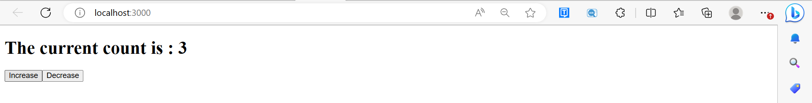

# React Props

* Props stand for "Properties." They are read-only components. 

* It is an object which stores the value of attributes of a tag and work similar to the HTML attributes. 

* It gives a way to pass data from one component to other components. It is similar to function arguments. Props are passed to the component in the same way as arguments passed in a function.

* Props are immutable so we cannot modify the props from inside the component. 

* Inside the components, we can add attributes called props. These attributes are available in the component as this.props and can be used to render dynamic data in our render method.

* When you need immutable data in the component, you have to add props to reactDom.render() method in the 
main.js file of your ReactJS project and used it inside the component in which you need.


`React Props`

* React Props are like function arguments in JavaScript and attributes in HTML.

* To send props into a component, use the same syntax as HTML attributes:

`Example:`

```markdown
import React from 'react';
import ReactDOM from 'react-dom/client';

function Car(props) {
  return <h2>I am a { props.brand }!</h2>;
}

const myElement = <Car brand="Ford" />;

const root = ReactDOM.createRoot(document.getElementById('root'));

root.render(myElement);
```

`Output:`

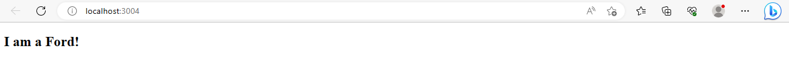

The component receives the argument as a props object:

`Pass Data`

Props are also how you pass data from one component to another, as parameters.

`Example:`

Send the "brand" property from the Garage component to the Car component:

```markdown
import React from 'react';
import ReactDOM from 'react-dom/client';

function Car(props) {
  return <h2>I am a { props.brand }!</h2>;
}

function Garage() {
  return (
    <>
	    <h1>Who lives in my garage?</h1>
	    <Car brand="Ford" />
    </>
  );
}

const root = ReactDOM.createRoot(document.getElementById('root'));
root.render(<Garage />);
```

`Output:`

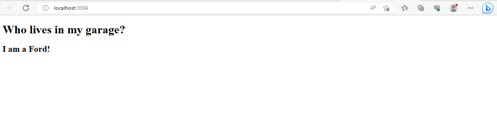

>**Note**: React Props are read-only! You will get an error if you try to change their value.


# React Props Validation

* Props are an important mechanism for passing the read-only attributes to React components. 

* The props are usually required to use correctly in the component. 

* If it is not used correctly, the components may not behave as expected. Hence, it is required to use props validation in improving react components.

* Props validation is a tool that will help the developers to avoid future bugs and problems. 

* It is a useful way to force the correct usage of your components. 

* It makes your code more readable. React components used special property PropTypes that help you to catch bugs by validating data types of values passed through props, although it is not necessary to define components with propTypes. 

* However, if you use propTypes with your components, it helps you to avoid unexpected bugs.


`Validating Props`

App.propTypes is used for props validation in react component. When some of the props are passed with an invalid type, you will get the warnings on JavaScript console. After specifying the validation patterns, you will set the App.defaultProps.

`Syntax`

```markdown
class App extends React.Component {  
          render() {}  
}  
Component.propTypes = { /*Definition */}; 
```

`ReactJS Props Validator`

ReactJS props validator contains the following list of validators.

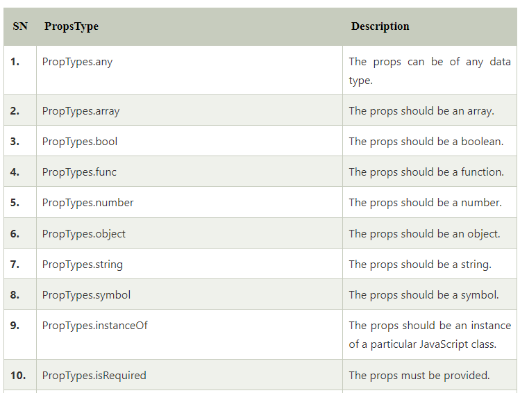

`Example:`

Here, we are creating an App component which contains all the props that we need. In this example, App.

propTypes is used for props validation. For props validation, you must have to add this line: import 
PropTypes from 'prop-types' in App.js file.

`App.js`

```markdown
import React, { Component } from 'react';  
import PropTypes from 'prop-types';  
class App extends React.Component {  
   render() {  
      return (  
          <div>  
              <h1>ReactJS Props validation example</h1>  
              <table>  
                  <tr>  
                      <th>Type</th>  
                      <th>Value</th>  
                      <th>Valid</th>  
                  </tr>  
                <tr>  
                      <td>Array</td>  
                      <td>{this.props.propArray}</td>  
                      <td>{this.props.propArray ? "true" : "False"}</td>  
                  </tr>  
                  <tr>  
                      <td>Boolean</td>  
                      <td>{this.props.propBool ? "true" : "False"}</td>  
                      <td>{this.props.propBool ? "true" : "False"}</td>  
                  </tr>  
                  <tr>  
                      <td>Function</td>  
                      <td>{this.props.propFunc(5)}</td>  
                      <td>{this.props.propFunc(5) ? "true" : "False"}</td>  
                  </tr>  
                  <tr>  
                      <td>String</td>  
                      <td>{this.props.propString}</td>  
                      <td>{this.props.propString ? "true" : "False"}</td>  
                  </tr>  
                  <tr>  
                      <td>Number</td>  
                      <td>{this.props.propNumber}</td>  
                      <td>{this.props.propNumber ? "true" : "False"}</td>  
                  </tr>  
             </table>  
        </div>  
        );  
   }  
}  
App.propTypes = {  
    propArray: PropTypes.array.isRequired,  
    propBool: PropTypes.bool.isRequired,  
    propFunc: PropTypes.func,  
    propNumber: PropTypes.number,  
    propString: PropTypes.string,   
}  
App.defaultProps = {  
    propArray: [1,2,3,4,5],  
    propBool: true,  
    propFunc: function(x){return x+5},  
    propNumber: 1,  
    propString: "JavaTpoint",  
}  
export default App;  
```

`Main.js`

```markdown
import React from 'react';  
import ReactDOM from 'react-dom';  
import App from './App.js';  
  
ReactDOM.render(<App/>, document.getElementById('app'));  
```


`Output:`

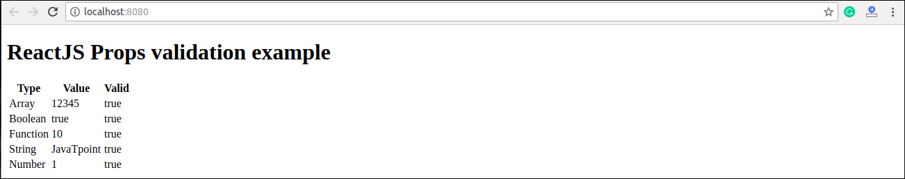


`ReactJS Custom Validators`

ReactJS allows creating a custom validation function to perform custom validation. The following argument is used to create a custom validation function.

* `props:` It should be the first argument in the component.

* `propName:` It is the propName that is going to validate.

* `componentName:` It is the componentName that are going to validated again.

`Example:`

```markdown
var Component = React.createClass({  
App.propTypes = {  
   customProp: function(props, propName, componentName) {  
        if (!item.isValid(props[propName])) {  
          return new Error('Validation failed!');  
        }  
      }  
   }  
})  
```

# State Vs. Props

`State`

* The state is an updatable structure that is used to contain data or information about the component and can change over time. 

* The change in state can happen as a response to user action or system event. 

* It is the heart of the react component which determines the behavior of the component and how it will render. A state must be kept as simple as possible. 

* It represents the component's local state or information. It can only be accessed or modified inside the component or by the component directly.

`Props`

* Props are read-only components. 

* It is an object which stores the value of attributes of a tag and work similar to the HTML attributes. 

* It allows passing data from one component to other components. 

* It is similar to function arguments and can be passed to the component the same way as arguments passed in a function. 

* Props are immutable so we cannot modify the props from inside the component.

`Difference between State and Props`

| Props              |          State         |
|----------------------|------------------------|
|Props are read-only.	|State changes can be asynchronous.|
|Props are immutable.	|State is mutable.|
|Props allow you to pass data from one component to other components as an argument.|	State holds information about the components.|
|Props can be accessed by the child component.	|State cannot be accessed by child components.|
|Props are used to communicate between components.|	States can be used for rendering dynamic changes with the component.|
|Stateless component can have Props.	|Stateless components cannot have State.|
|Props make components reusable.	|State cannot make components reusable.|
|Props are external and controlled by whatever renders the component.	|The State is internal and controlled by the React Component itself.|


# React Constructor

* The constructor is a method used to initialize an object's state in a class. 

* It automatically called during the creation of an object in a class. 

* The concept of a constructor is the same in React. The constructor in a React component is called before the component is mounted. 

* When you implement the constructor for a React component, you need to call super() method before any other statement. 

* If you do not call super() method, this.props will be undefined in the constructor and can lead to bugs.

`Syntax:`

```markdown
Constructor(props){  
     super(props);  
}  
```

In React, it has a few rules that you can follow when using them.

`Step 1:` Call super(props) before using this.props

Due to the nature of the constructor, this.props object is not accessible straight out of the gate, which can lead to errors. An error will be thrown by this constructor:

```
constructor() {
 console.log(this.props);
}

```

Instead, we transfer the value of a prop to the super() function from the constructor():

```
constructor(props) {
 super(props);
 console.log(this.props);
}

```

When you call the super() function, the parent class constructor is called, which is in the case of a React is React.Component. 

`Step 2:` Never call setState() inside constructor()

The constructor of your component is the ideal place to set the component’s initial state. You must set the initial state directly, rather than using setState() as you can in other methods in your class:

```
constructor(props) {
 super(props);
 this.state = {
   name 'kapil',
   age: 22,
 };
}

```

The only place you can assign the local state directly like that is the constructor. You should depend on setState() somewhere else inside our component instead.

`Step 3:` Avoid assigning values from this.props to this.state

You should try to avoid setting values from the properties when setting the initial component state in the constructor. We can do the following:

```
constructor(props) {
 super(props);
 this.state = {
   name: props.name,
 };
}
```

You wouldn’t be allowed to use setState() to change the property later. You may easily reference the property directly in your code by naming this.props.name, instead of assigning the property directly to the state.

`Step 4:` Bind events all in one place

We can easily bind your event handlers in the constructor:

```
constructor(props) {
 super(props);
 this.state = {
   // Sets that initial state
 };
 // Our event handlers
 this.onClick = this.onClick.bind(this);
 this.onKeyUp = this.onKeyUp.bind(this);
 // Rest Code
}

```

In React, constructors are mainly used for two purposes:

1. It used for initializing the local state of the component by assigning an object to this.state.

2. It used for binding event handler methods that occur in your component.

* Note: If you neither initialize state nor bind methods for your React component, there is no need to 

`Implement a constructor for React component`

You cannot call setState() method directly in the constructor(). If the component needs to use local state you need directly to use 'this.state' to assign the initial state in the constructor. The constructor only uses this.state to assign initial state, and all other methods need to use set.state() method.

`Example:`

The concept of the constructor can understand from the below example.

`App.js`

```markdown
import React, { Component } from 'react';
class App extends Component {

constructor(props) {

  // Calling super class constructor
  super(props);
  
  // Creating state
  this.state = {
  data: 'My name is User'
  }
  
  // Binding event handler
  this.handleEvent = this.handleEvent.bind(this);
}

handleEvent() {
  console.log(this.props);
}

render() {
  return (
  <div >
    <input type="text" value={this.state.data} />
    <br></br> <br></br>
    <button onClick={this.handleEvent}>Please Click</button>
  </div>
  );
}
}

export default App;
  
```

`Output:`

When you execute the above code, you get the following output.

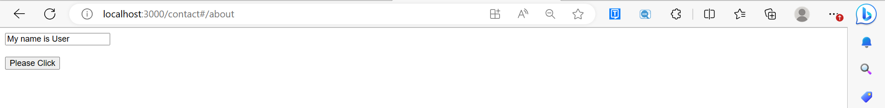

# React Events

* An action triggered as a result of the user action or system-generated event is termed as an event. 

* The React event handling system, also known as Synthetic Events is a cross-browser wrapper of the browser’s native event and is much like handling events on DOM elements but have some syntactic differences.

* A function in ReactJS is passed as the event handler with the use of JSX, instead of passing it as a string.

* To prevent the default behaviour, the preventDefault event must be called explicitly in ReactJS instead of returning false.


`Adding Events`

* React events are written in camelCase syntax:

* onClick instead of onclick.

* React event handlers are written inside curly braces:

* onClick={shoot}  instead of onClick="shoot()".

`Example:`


```markdown
import React, { Component } from 'react';  
class App extends React.Component {  
constructor(props) {  
super(props);  
this.state = {  
StudName: ''  
};  
}  
changeText(event) {  
this.setState({  
StudName: event.target.value  
});  
}  
render() {  
return (  
<div>  
<h2>Event</h2>  
<label htmlFor="name">Student name: </label>  
<input type="text" id="StudName" onChange={this.changeText.bind(this)}/>  
<h4>Entered name: { this.state.StudName }</h4>  
</div>  
);  
}  
}  
export default App;

```

`Output:`

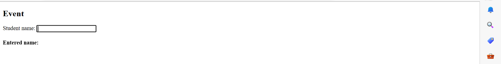

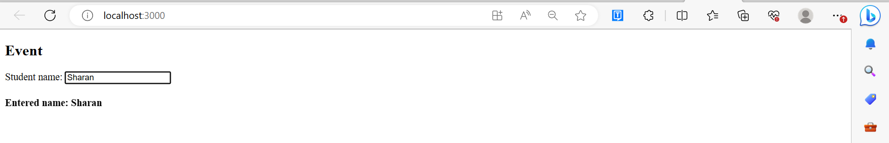

# React List

* Lists are used to display data in an ordered format and mainly used to display menus on websites. 

* In React, Lists can be created in a similar way as we create lists in JavaScript. 

* The map() function is used for traversing the lists. 

* In the below example, the map() function takes an array of numbers and multiply their values with 5. We assign the new array returned by map() to the variable  multiplyNums and log it.


`Example:`

```markdown

var numbers = [1, 2, 3, 4, 5];   
const multiplyNums = numbers.map((number)=>{   
    return (number * 5);   
});   
console.log(multiplyNums);
```

`Output:`

The above JavaScript code will log the output on the console. The output of the code is given below.

```bash  +@output

[5, 10, 15, 20, 25]
```

Now, let us see how we create a list in React. To do this, we will use the map() function for traversing the list element, and for updates, we enclosed them between curly braces {}. Finally, we assign the array elements to listItems. Now, include this new list inside` <ul> </ul>` elements and render it to the DOM.


`Example:`

```markdown

import React from 'react';   
import ReactDOM from 'react-dom';   
  
const myList = ['Peter', 'Sachin', 'Kevin', 'Dhoni', 'Alisa'];   
const listItems = myList.map((myList)=>{   
    return <li>{myList}</li>;   
});   
ReactDOM.render(   
    <ul> {listItems} </ul>,   
    document.getElementById('app')   
);   
export default App; 
``` 


`Output:`

```bash  +@output

* Peter

* Sachin

* Kelvin

* Dhoni

* Alisa
```


`Rendering Lists inside components`

* In the previous example, we had directly rendered the list to the DOM. But it is not a good practice to render lists in React. 

* In React, we had already seen that everything is built as individual components. Hence, we would need to render lists inside a component. We can understand it in the following code.


`Example:`

```markdown

import React from 'react';   
import ReactDOM from 'react-dom';   
  
function NameList(props) {  
  const myLists = props.myLists;  
  const listItems = myLists.map((myList) =>  
    <li>{myList}</li>  
  );  
  return (  
    <div>  
        <h2>Rendering Lists inside component</h2>  
              <ul>{listItems}</ul>  
    </div>  
  );  
}  
const myLists = ['Peter', 'Sachin', 'Kevin', 'Dhoni', 'Alisa'];   
ReactDOM.render(  
  <NameList myLists={myLists} />,  
  document.getElementById('app')  
);  
export default App;
```


`Output:`

```bash  +@output

Rendering Lists inside component

* Peter

* Sachin

* Kelvin

* Dhoni

* Alisa
```

# React Keys

* A “key” is a special string attribute you need to include when creating lists of elements in React. 

* Keys are used in React to identify which items in the list are changed, updated, or deleted.

* Keys are used to give an identity to the elements in the lists. 

* It is recommended to use a string as a key that uniquely identifies the items in the list. 

`Assigning keys to the list`

You can assign the array indexes as keys to the list items. The below example assigns array indexes as keys to the elements. 

`Syntax:`

```
const numbers = [1, 2, 3, 4, 5];
const updatedNums = numbers.map((number, index) =>
    <li key={index}>
        {number}
    </li>
);

```

`Using Keys with component`

* Consider you have created a separate component for ListItem and extracting ListItem from that component. 

* In this case, you should have to assign keys on the [<ListItem />]ListItem elements in the array, not to the [li]  elements in the ListItem itself. 

* To avoid mistakes, you have to keep in mind that keys only make sense in the context of the surrounding array. So, anything you are returning from map() function is recommended to be assigned a key

## Incorrect Key usage

`Example:`

```

import React from 'react';

function ListItem(props) {
  const item = props.item;
  return (
    <li>
      {item}
    </li>
  );
}

function NameList(props) {
  const myLists = props.myLists;
  const listItems = myLists.map((strLists) =>
    <ListItem item={strLists} /> // Incorrect key usage
  );
  return (
    <div>
      <h2>Incorrect Key Usage Example</h2>
      <ol>{listItems}</ol>
    </div>
  );
}

export default function App() {
  const myLists = ['Peter', 'Sachin', 'Kevin', 'Dhoni', 'Alisa'];

  return (
    <div>
      <NameList myLists={myLists} />
    </div>
  );
}

//In the given example, the list is rendered successfully. But it is not a good practice that we had not 
//assigned a key to the map() iterator.

```

`Output:`You can see in the below output that the list is rendered successfully but a warning is thrown to the console that the elements inside the iterator are not assigned keys. This is because we had not assigned the key to the elements we are returning to the map() iterator.

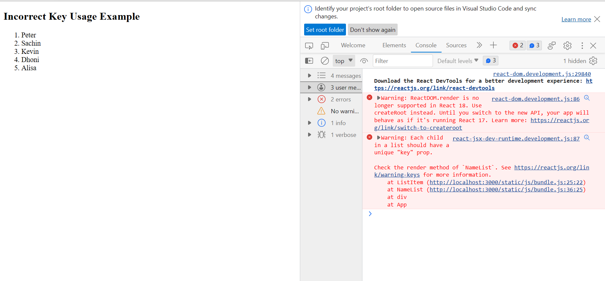

## Correct usage of keys

`Example:` The below example shows the correct usage of keys:

```

import React from 'react';

function MenuItems(props) {
  const item = props.item;
  return <li>{item}</li>;
}

function Navmenu(props) {
  const list = props.menuitems;
  const updatedList = list.map((listItems) => {
    return <MenuItems key={listItems.toString()} item={listItems} />;
  });

  return <ul>{updatedList}</ul>;
}

const menuItems = [1, 2, 3, 4, 5];

export default function App() {
  return (
    <div>
      <h1>Menu Example</h1>
      <Navmenu menuitems={menuItems} />
    </div>
  );
}

```

`Output:`

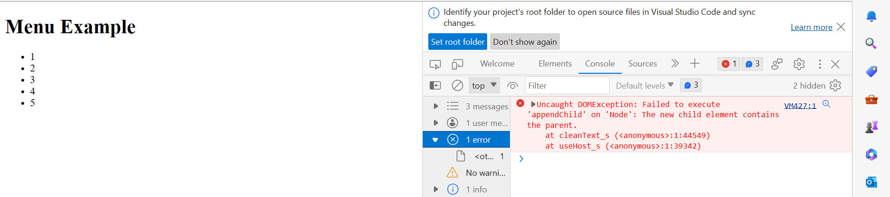

## Uniqueness of Keys 

* We have told many times while discussing keys that keys assigned to the array elements must be unique. 

* By this, we did not mean that the keys should be globally unique. All the elements in a particular array should have unique keys. That is, two different arrays can have the same set of keys.

`Example:` In the below code, we have created two different arrays.You can see in the below code that the keys for the first 5 items for both arrays are the same still the code runs successfully without any warning.

```
import React from "react";
import ReactDOM from "react-dom";

function MenuItems(props) {
  const item = props.item;
  return <li>{item}</li>;
}

function Navmenu(props) {
  const list = props.menuitems;
  const updatedList = list.map((listItems) => {
    return <MenuItems key={listItems.toString()} item={listItems} />;
  });

  return <ul>{updatedList}</ul>;
}

function App() {
  const menuItems1 = [1, 2, 3, 4, 5];
  const menuItems2 = [1, 2, 3, 4, 5, 6];

  return (
    <div>
      <Navmenu menuitems={menuItems1} />
      <Navmenu menuitems={menuItems2} />
    </div>
  );
}

export default App;

```

`Output:`

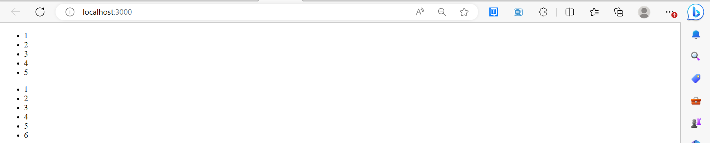


# React Fragments

* In React, whenever you want to render something on the screen, you need to use a render method inside the component. 

* This render method can return single elements or multiple elements. 

* The render method will only render a single root node inside it at a time. 

* However, if you want to return multiple elements, the render method will require a 'div' tag and put the entire content or elements inside it. This extra node to the DOM sometimes results in the wrong formatting of your HTML output

`Example:`

`App.js`

```
import React from "react";

// Simple rendering with div
class App extends React.Component {
	render() {
		return (
			// Extraneous div element
			<div>
				<h2>Hello</h2>

				<p>How you doin'?</p>
			</div>
		);
	}
}

export default App;


```

`Output:`


`Reason to use Fragments:` As we saw in the above code when we are trying to render more than one root element we have to put the entire content inside the ‘div’ tag which is not loved by many developers. So in React 16.2 version, Fragments were introduced, and we use them instead of the extraneous ‘div’ tag. 

`Syntax:`

```
<React.Fragment>  
    <h2>Child-1</h2>   
    <p> Child-2</p>   
</React.Fragment> 

```

`Example:` Open App.js and replace the code with the below code.

```
import React from "react";

// Simple rendering with fragment syntax
class App extends React.Component {
	render() {
		return (
			<React.Fragment>
				<h2>Hello</h2>

				<p>How you doin'?</p>
			</React.Fragment>
		);
	}
}

export default App;
```

`Output:`


`Shorthand Fragment:` The output of the first code and the code above is the same but the main reason for using is that it is a tiny bit faster when compared to the one with the ‘div’ tag inside it, as we didn’t create any DOM node. Also, it takes less memory. Another shorthand also exists for the above method in which we make use of ‘<>’ and ‘</>’ instead of the ‘React.Fragment’. 

>**Note:** The shorthand syntax does not accept key attributes in that case you have to use the <React.Fragments> tag.

`Syntax:`

```
<>  
    <h2>Child-1</h2>   
    <p> Child-2</p>   
</> 

```

`Example:`

```
import React from "react";

// Simple rendering with short syntax
class App extends React.Component {
	render() {
		return (
			<>
				<h2>Hello</h2>

				<p>How you doin'?</p>
			</>
		);
	}
}

export default App;


```

`Output:`


`Keyed Fragments`

* The shorthand syntax does not accept key attributes. 

* You need a key for mapping a collection to an array of fragments such as to create a description list. 

* If you need to provide keys, you have to declare the  fragments with the explicit `<React.Fragment>`syntax.

>**Note:** Key is the only attributes that can be passed with the Fragments.


`Example:`

```markdown

Function  = (props) {  
  return (  
    <Fragment>  
      {props.items.data.map(item => (  
        // Without the 'key', React will give a key warning  
        <React.Fragment key={item.id}>  
          <h2>{item.name}</h2>  
          <p>{item.url}</p>  
          <p>{item.description}</p>  
        </React.Fragment>  
      ))}  
    </Fragment>  
  )  
}  

```

# React Router

* Routing is a process in which a user is directed to different pages based on their action or request. 

* ReactJS Router is mainly used for developing Single Page Web Applications. 

* React Router is used to define multiple routes in the application. When a user types a specific URL into the browser, and if this URL path matches any 'route' inside the router file, the user will be redirected to that particular route.

* React Router is a standard library system built on top of the React and used to create routing in the React application using React Router Package.

`Installing React Router`

React contains three different packages for routing. These are:

`react-router:` It provides the core routing components and functions for the React Router applications.

`react-router-native:` It is used for mobile applications.

`react-router-dom:` It is used for web applications design.

To `install` react-router in your application write the following command in your terminal

```
// Installing
npm i react-router-dom

```
`Importing React Router`

```
// Importing
import { BrowserRouter, Routes, Route } from "react-router-dom";
```

## React Router Components:

The Main Components of React Router are:

* `BrowserRouter:` BrowserRouter is a router implementation that uses the HTML5 history API(pushState, replaceState, and the popstate event) to keep your UI in sync with the URL. It is the parent component that is used to store all of the other components.

* `Routes:` It’s a new component introduced in the v6 and an upgrade of the component. The main advantages of Routes over Switch are:

*	Relative s and s

*	Routes are chosen based on the best match instead of being traversed in order.

*	`Route:` Route is the conditionally shown component that renders some UI when its path matches the current URL.

*	`Link:` The link component is used to create links to different routes and implement navigation around the application. It works like an HTML anchor tag.

`Implementing React Router`

To use React Router, let us first create a few components in the React application. In your project directory, create a folder named component inside the src folder and now add 3 files named.

•	home.js

•	about.js

•	contact.js

>**Note:** Remove/Comment the default styling provided with App.css

`home.js`

```
// Home.js
import React from 'react';

function Home (){
	return <h1>Welcome to the world of Geeks!</h1>
}

export default Home;
```

`about.js`

```
// About.js
import React from 'react';

function About () {
	return <div>
		<h2>GeeksforGeeks is a computer science portal for geeks!</h2>

		Read more about us at :
		<a href="https://www.geeksforgeeks.org/about/">
			https://www.geeksforgeeks.org/about/
		</a>
	</div>
}
export default About;
```

`contact.js`

```
// Contact.js
import React from 'react';

function Contact (){
return <address>
			You can find us here:<br />
			GeeksforGeeks<br />
			5th & 6th Floor, Royal Kapsons, A- 118, <br />
			Sector- 136, Noida, Uttar Pradesh (201305)
		</address>
}

export default Contact;
```

Now, let us include React Router components to the application:

After adding all the components here is our complete source code:

`App.js`

```
import React, { Component } from 'react';
import { BrowserRouter as Router,Routes, Route, Link } from 'react-router-dom';
import Home from './component/home';
import About from './component/about';
import Contact from './component/contact';
import './App.css';

class App extends Component {
render() {
	return (
	<Router>
		<div className="App">
			<ul className="App-header">
			<li>
				<Link to="/">Home</Link>
			</li>
			<li>
				<Link to="/about">About Us</Link>
			</li>
			<li>
				<Link to="/contact">Contact Us</Link>
			</li>
			</ul>
		<Routes>
				<Route exact path='/' element={< Home />}></Route>
				<Route exact path='/about' element={< About />}></Route>
				<Route exact path='/contact' element={< Contact />}></Route>
		</Routes>
		</div>
	</Router>
);
}
}

export default App;

```

`Output:`

* **This is the Home page** 


* **If we Click on the About us, the page will be redirected.**


* **If u click on contact us .the page will be redirected.**


## ReactJS Types of Routers

React Router provides three different kinds of routers: 

•	Memory Router

•	Browser Router

•	Hash Router

`Memory Router:` The memory router keeps the URL changes in memory not in the user browsers. It keeps the history of the URL in memory and it does not read or write to the address bar so the user can not use the browser’s back button as well as the forward button. It doesn’t change the URL in your browser. It is very useful for testing and non-browser environments like React Native.

`Syntax:`

```
import { MemoryRouter as Router } from 'react-router-dom';
```

`Example:`

```
import React, { Component } from 'react';
import { MemoryRouter as Router, Routes, Route, Link } from 'react-router-dom';
import Home from './home';
import About from './about';
import Contact from './contact';
import './App.css';

class App extends Component {
  render() {
    return (
      <Router>
        <div className="App">
          <ul className="App-header">
            <li>
              <Link to="/">Home</Link>
            </li>
            <li>
              <Link to="/about">About Us</Link>
            </li>
            <li>
              <Link to="/contact">Contact Us</Link>
            </li>
          </ul>
          <Routes>
            <Route path="/" element={<Home />} />
            <Route path="/about" element={<About />} />
            <Route path="/contact" element={<Contact />} />
          </Routes>
        </div>
      </Router>
    );
  }
}
export default App;
```
`Output:`

Here in this Output if u click back or forward button in the browser it wont work.


## Browser Router

`Browser Router:` It uses HTML 5 history API (i.e. pushState, replaceState, and popState API) to keep your UI in sync with the URL. It routes as a normal URL in the browser and assumes that the server is handling all the request URL (eg., /, /about) and points to root index.html. It accepts forceRefresh props to support legacy browsers that don’t support HTML 5 pushState API

`Syntax:`

```
import { BrowserRouter as Router } from 'react-router-dom';

```

`Example:`

```
import React, { Component } from 'react';
import { BrowserRouter as Router, Routes, Route, Link } from 'react-router-dom';
import Home from './home';
import About from './about';
import Contact from './contact';
import './App.css';

class App extends Component {
  render() {
    return (
      <Router>
        <div className="App">
          <ul className="App-header">
            <li>
              <Link to="/">Home</Link>
            </li>
            <li>
              <Link to="/about">About Us</Link>
            </li>
            <li>
              <Link to="/contact">Contact Us</Link>
            </li>
          </ul>
          <Routes>
            <Route path="/" element={<Home />} />
            <Route path="/about" element={<About />} />
            <Route path="/contact" element={<Contact />} />
          </Routes>
        </div>
      </Router>
    );
  }
}
export default App;

```

`Output:`


Here in this Output if u click back or forward button in the browser it will work.

## Hash Router

`Hash Router:` Hash router uses client-side hash routing. It uses the hash portion of the URL (i.e. window.location.hash) to keep your UI in sync with the URL. The hash portion of the URL won’t be handled by the server, the server will always send the index.html for every request and ignore the hash value. It doesn’t need any configuration in the server to handle routes. It is used to support legacy browsers which usually don’t support HTML pushState API. It is very useful for legacy browsers or you don’t have a server logic to handle the client-side. This route isn’t recommended to be used by the react-router-dom team.

`Syntax:`

```
import { HashRouter as Router } from 'react-router-dom';
```
`Example:`

```
import React, { Component } from 'react';
import { HashRouter as Router , Route, Routes, Link } from 'react-router-dom';
import Home from './home';
import About from './about';
import Contact from './contact';
import './App.css';

class App extends Component {
    render() {
        return (
            <Router>
                <div className="App">
                    <ul className="App-header">
                        <li>
                            <Link to="/">Home</Link>
                        </li>
                        <li>
                            <Link to="/about">About Us</Link>
                        </li>
                        <li>
                            <Link to="/contact">Contact Us</Link>
                        </li>
                    </ul>
                    <Routes>
                        <Route path="/" element={<Home />} />
                        <Route path="/about" element={<About />} />
                        <Route path="/contact" element={<Contact />} />
                    </Routes>
                </div>
            </Router>
        );
    }
}

export default App;

```
`Output:`


# Adding Navigation using Link component

Sometimes, we want to need multiple links on a single page. When we click on any of that particular Link, it should load that page which is associated with that path without reloading the web page. To do this, we need to import `<Link>` component in the index.js file.

`What is <Link> component?`

This component is used to create links which allow to navigate on different URLs and render its content without reloading the webpage.

`Example:`

`Index.js`

```markdown
import React from 'react';  
import ReactDOM from 'react-dom';  
import { Route, Link, BrowserRouter as Router } from 'react-router-dom'  
import './index.css';  
import App from './App';  
import About from './about'  
import Contact from './contact'  
  
const routing = (  
  <Router>  
    <div>  
      <h1>React Router Example</h1>  
      <ul>  
        <li>  
          <Link to="/">Home</Link>  
        </li>  
        <li>  
          <Link to="/about">About</Link>  
        </li>  
        <li>  
          <Link to="/contact">Contact</Link>  
        </li>  
      </ul>  
      <Route exact path="/" component={App} />  
      <Route path="/about" component={About} />  
      <Route path="/contact" component={Contact} />  
    </div>  
  </Router>  
)  
ReactDOM.render(routing, document.getElementById('root'));  
```

`Output:`

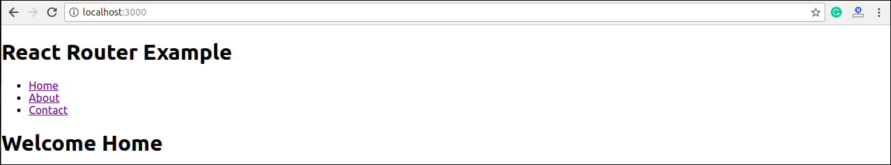

After adding Link, you can see that the routes are rendered on the screen. Now, if you click on the About, you will see URL is changing and About component is rendered.

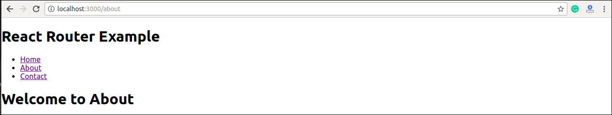

Now, we need to add some styles to the Link. So that when we click on any particular link, it can be easily
identified which Link is active. To do this react router provides a new trick NavLink instead of Link. Now, 
in the index.js file, replace Link from Navlink and add properties activeStyle. The activeStyle properties 
mean when we click on the Link, it should have a specific style so that we can differentiate which one is
currently active.

```

import React from 'react';  
import ReactDOM from 'react-dom';  
import { BrowserRouter as Router, Route, Link, NavLink } from 'react-router-dom'  
import './index.css';  
import App from './App';  
import About from './about'  
import Contact from './contact'  
  
const routing = (  
  <Router>  
    <div>  
      <h1>React Router Example</h1>  
      <ul>  
        <li>  
          <NavLink to="/" exact activeStyle={  
             {color:'red'}  
          }>Home</NavLink>  
        </li>  
        <li>  
          <NavLink to="/about" exact activeStyle={  
             {color:'green'}  
          }>About</NavLink>  
        </li>  
        <li>  
          <NavLink to="/contact" exact activeStyle={  
             {color:'magenta'}  
          }>Contact</NavLink>  
        </li>  
      </ul>  
      <Route exact path="/" component={App} />  
      <Route path="/about" component={About} />  
      <Route path="/contact" component={Contact} />  
    </div>  
  </Router>  
)  
ReactDOM.render(routing, document.getElementById('root'));  
```


`Output:`

When we execute the above program, we will get the following screen in which we can see that Home link is of color Red and is the only currently active link.

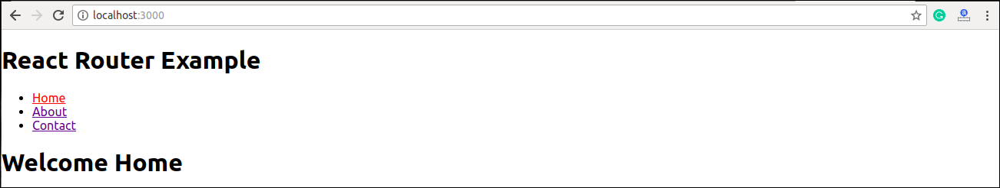

Now, when we click on About link, its color shown green that is the currently active link.

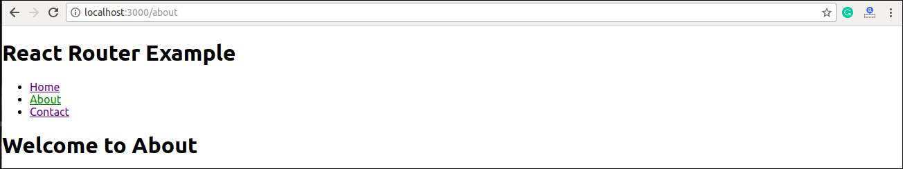


`<Link> vs <NavLink>`

The Link component allows navigating the different routes on the websites, whereas NavLink component is used 
to add styles to the active routes.


`React Router Switch`

The `<Switch> `component is used to render components only when the path will be matched. Otherwise, it 
returns to the not found component.

To understand this, first, we need to create a notfound component.

`notfound.js`

```markdown

import React from 'react'  
const Notfound = () => <h1>Not found</h1>  
export default Notfound 
``` 

Now, import component in the index.js file. It can be seen in the below code.

`Index.js`

```

import React from 'react';  
import ReactDOM from 'react-dom';  
import { BrowserRouter as Router, Route, Link, NavLink, Switch } from 'react-router-dom'  
import './index.css';  
import App from './App';  
import About from './about'  
import Contact from './contact'  
import Notfound from './notfound'  
  
const routing = (  
  <Router>  
    <div>  
      <h1>React Router Example</h1>  
      <ul>  
        <li>  
          <NavLink to="/" exact activeStyle={  
             {color:'red'}  
          }>Home</NavLink>  
        </li>  
        <li>  
          <NavLink to="/about" exact activeStyle={  
             {color:'green'}  
          }>About</NavLink>  
        </li>  
        <li>  
          <NavLink to="/contact" exact activeStyle={  
             {color:'magenta'}  
          }>Contact</NavLink>  
        </li>  
      </ul>  
      <Switch>  
         <Route exact path="/" component={App} />  
         <Route path="/about" component={About} />  
         <Route path="/contact" component={Contact} />  
         <Route component={Notfound} />  
      </Switch>  
    </div>  
  </Router>  
)  
ReactDOM.render(routing, document.getElementById('root'));  
```

`Output:`

If we manually enter the wrong path, it will give the not found error.

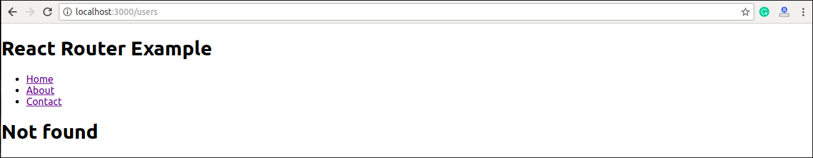

`React Router <Redirect>`

A `<Redirect>` component is used to redirect to another route in our application to maintain the old URLs. It 
can be placed anywhere in the route hierarchy.

`Nested Routing in React`

Nested routing allows you to render sub-routes in your application. It can be understood in the below example.

`Example`

`Index.js`

```

import React from 'react';  
import ReactDOM from 'react-dom';  
import { BrowserRouter as Router, Route, Link, NavLink, Switch } from 'react-router-dom'  
import './index.css';  
import App from './App';  
import About from './about'  
import Contact from './contact'  
import Notfound from './notfound'  
  
const routing = (  
  <Router>  
    <div>  
      <h1>React Router Example</h1>  
      <ul>  
        <li>  
          <NavLink to="/" exact activeStyle={  
             {color:'red'}  
          }>Home</NavLink>  
        </li>  
        <li>  
          <NavLink to="/about" exact activeStyle={  
             {color:'green'}  
          }>About</NavLink>  
        </li>  
        <li>  
          <NavLink to="/contact" exact activeStyle={  
             {color:'magenta'}  
          }>Contact</NavLink>  
        </li>  
      </ul>  
      <Switch>  
         <Route exact path="/" component={App} />  
         <Route path="/about" component={About} />  
         <Route path="/contact" component={Contact} />  
         <Route component={Notfound} />  
      </Switch>  
    </div>  
  </Router>  
)  
ReactDOM.render(routing, document.getElementById('root'));  
```

In the contact.js file, we need to import the React Router component to implement the subroutes.


`contact.js`

```

import React from 'react'  
import { Route, Link } from 'react-router-dom'  
  
const Contacts = ({ match }) => <p>{match.params.id}</p>  
  
class Contact extends React.Component {  
  render() {  
    const { url } = this.props.match  
    return (  
      <div>  
        <h1>Welcome to Contact Page</h1>  
        <strong>Select contact Id</strong>  
        <ul>  
          <li>  
            <Link to="/contact/1">Contacts 1 </Link>  
          </li>  
          <li>  
            <Link to="/contact/2">Contacts 2 </Link>  
          </li>  
          <li>  
            <Link to="/contact/3">Contacts 3 </Link>  
          </li>  
          <li>  
            <Link to="/contact/4">Contacts 4 </Link>  
          </li>  
        </ul>  
        <Route path="/contact/:id" component={Contacts} />  
      </div>  
    )  
  }  
}  
export default Contact  
```

`Output:`

When we execute the above program, we will get the following output.

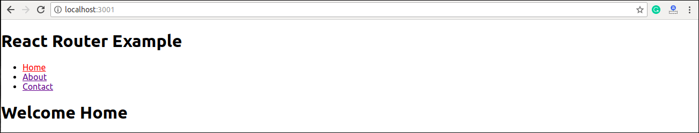

After clicking the Contact link, we will get the contact list. Now, selecting any contact, we will get the
corresponding output. It can be shown in the below example.


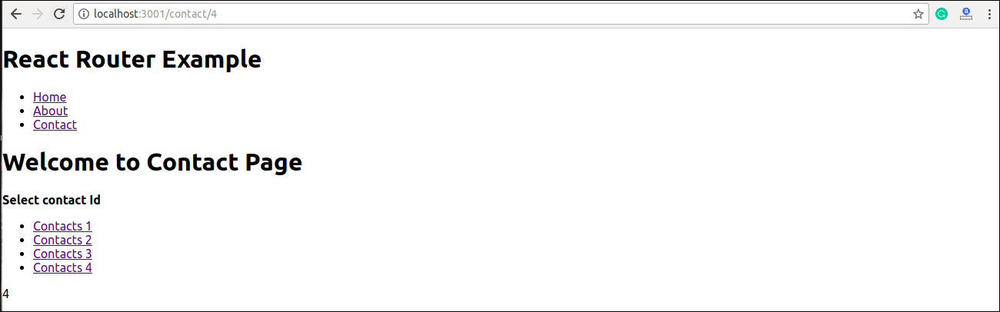


`Benefits Of React Router`

The benefits of React Router is given below:

* In this, it is not necessary to set the browser history manually.
* Link uses to navigate the internal links in the application. It is similar to the anchor tag.
* It uses Switch feature for rendering.
* The Router needs only a Single Child element.
* In this, every component is specified in .


# React Forms

* Forms are really important in any website for login, signup, or whatever. 

* It is easy to make a form in HTML but forms in React work a little differently. 

* In HTML the form data is usually handled by the DOM itself but in the case of react the form data is handled by the react components. 

* All the form data is stored in the react’s component state, so it can handle the form submission and retrieve data that the user entered. To do this we use controlled components.


`Adding Forms in React`

You add a form with React like any other element:

`Example`

Add a form that allows users to enter their name:

```
import React from 'react';
import ReactDOM from 'react-dom/client';

function MyForm() {
  return (
    <form>
      <label>Enter your name:
        <input type="text" />
      </label>
    </form>
  )
}

const root = ReactDOM.createRoot(document.getElementById('root'));
root.render(<MyForm />);
```

`Output`

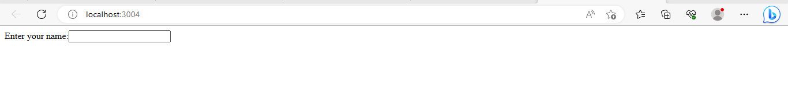

This will work as normal, the form will submit and the page will refresh.

But this is generally not what we want to happen in React.

We want to prevent this default behavior and let React control the form.


`Handling Forms`

* Handling forms is about how you handle the data when it changes value or gets submitted.

* In HTML, form data is usually handled by the DOM.

* In React, form data is usually handled by the components.

* When the data is handled by the components, all the data is stored in the component state.

* You can control changes by adding event handlers in the onChange attribute.

* We can use the useState Hook to keep track of each inputs value and provide a "single source of truth" for the entire application.


`Example:`

Use the useState Hook to manage the input:

```

import { useState } from "react";
import ReactDOM from 'react-dom/client';

function MyForm() {
  const [name, setName] = useState("");

  return (
    <form>
      <label>Enter your name:
        <input
          type="text" 
          value={name}
          onChange={(e) => setName(e.target.value)}
        />
      </label>
    </form>
  )
}

const root = ReactDOM.createRoot(document.getElementById('root'));
root.render(<MyForm />);
```


`Output:`

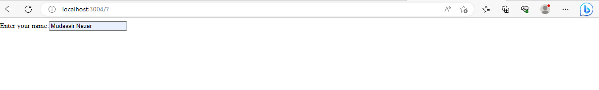

`Submitting Forms`

You can control the submit action by adding an event handler in the onSubmit attribute for the `<form>`:

`Example:`

Add a submit button and an event handler in the onSubmit attribute:

```
import { useState } from "react";
import ReactDOM from 'react-dom/client';

function MyForm() {
  const [name, setName] = useState("");

  const handleSubmit = (event) => {
    event.preventDefault();
    alert(`The name you entered was: ${name}`);
  }
  return (
    <form onSubmit={handleSubmit}>
      <label>Enter your name:
        <input 
          type="text" 
          value={name}
          onChange={(e) => setName(e.target.value)}
        />
      </label>
      <input type="submit" />
    </form>
  )
}
const root = ReactDOM.createRoot(document.getElementById('root'));
root.render(<MyForm />);
```

`Output:`

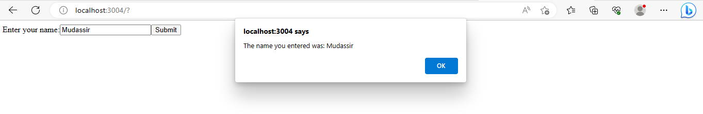


`Multiple Input fields`

* You can control the values of more than one input field by adding a name attribute to each element.

* We will initialize our state with an empty object.

* To access the fields in the event handler use the event.target.name and event.target.value syntax.

* To update the state, use square brackets [bracket notation] around the property name.

`Example:`

Write a form with two input fields:

```
import { useState } from "react";
import ReactDOM from "react-dom/client";

function MyForm() {
  const [inputs, setInputs] = useState({});

  const handleChange = (event) => {
    const name = event.target.name;
    const value = event.target.value;
    setInputs(values => ({...values, [name]: value}))
  }

  const handleSubmit = (event) => {
    event.preventDefault();
    console.log(inputs);
  }

  return (
    <form onSubmit={handleSubmit}>
      <label>Enter your name:
      <input 
        type="text" 
        name="username" 
        value={inputs.username || ""} 
        onChange={handleChange}
      />
      </label>
      <label>Enter your age:
        <input 
          type="number" 
          name="age" 
          value={inputs.age || ""} 
          onChange={handleChange}
        />
        </label>
        <input type="submit" />
    </form>
  )
}

const root = ReactDOM.createRoot(document.getElementById('root'));
root.render(<MyForm />);

```

`Output:`

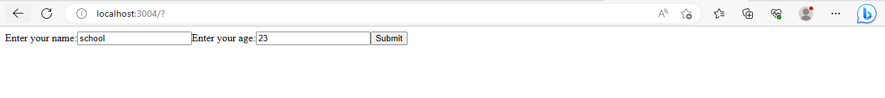

>Note: We use the same event handler function for both input fields, we could write one event handler for each, but this gives us much cleaner code and is the preferred way in React.

## Controlled Components

* In simple HTML elements like input tags, the value of the input field is changed whenever the user type. 

* But, In React, whatever the value the user types we save it in state and pass the same value to the input tag as its value, so here DOM does not change its value, it is controlled by react state.

`Example:`

```
import React, { Component } from 'react';  
class App extends React.Component {  
  constructor(props) {  
      super(props);  
      this.state = {value: ''};  
      this.handleChange = this.handleChange.bind(this);  
      this.handleSubmit = this.handleSubmit.bind(this);  
  }  
  handleChange(event) {  
      this.setState({value: event.target.value});  
  }  
  handleSubmit(event) {  
      alert('You have submitted the input successfully: ' + this.state.value);  
      event.preventDefault();  
  }  
  render() {  
      return (  
          <form onSubmit={this.handleSubmit}>  
            <h1>Controlled Form Example</h1>  
            <label>  
                Name:  
                <input type="text" value={this.state.value} onChange={this.handleChange} />  
            </label>  
            <input type="submit" value="Submit" />  
         </form>  
      );  
  }  
}  
export default App;


```

`Output:`

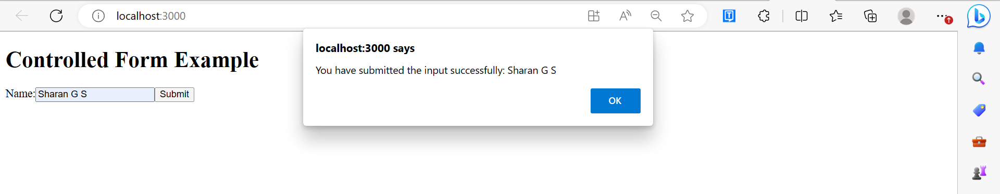

## Uncontrolled Components

* The uncontrolled input is similar to the traditional HTML form inputs. 

* The DOM itself handles the form data. Here, the HTML elements maintain their own state that will be updated when the input value changes. 
* To write an uncontrolled component, you need to use a ref to get form values from the DOM. In other words, there is no need to write an event handler for every state update. 

* You can use a ref to access the input field value of the form from the DOM.

`Example:`

In this example, the code accepts a field username and company name in an uncontrolled component.

```
import React, { Component } from 'react';  
class App extends React.Component {  
  constructor(props) {  
      super(props);  
      this.updateSubmit = this.updateSubmit.bind(this);  
      this.input = React.createRef();  
  }  
  updateSubmit(event) {  
      alert('You have entered the UserName and CompanyName successfully.');  
      event.preventDefault();  
  }  
  render() {  
    return (  
      <form onSubmit={this.updateSubmit}>  
        <h1>Uncontrolled Form Example</h1>  
        <label>Name:  
            <input type="text" ref={this.input} />  
        </label>  
        <label>  
            CompanyName:  
            <input type="text" ref={this.input} />  
        </label>  
        <input type="submit" value="Submit" />  
      </form>  
    );  
  }  
}  
export default App;

```

`Output:`

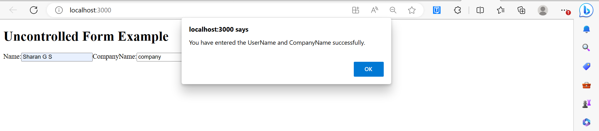

# React Map

* Map is a type of data structure or data collection that is used to store the data in the form of key and value pairs. 

* Each pair has a unique key in a map, and the value stored in each pair must be mapped to its unique key.

* Maps are useful when searching and looking up the data and the stored key’s uniqueness.

* In ReactJs, the maps are used for traversing or displaying the list of similar objects of a component. 

* The map method is a standard JavaScript function and not just a ReactJs feature that could be called on an array. 

* A new array is made using the map() method, and a function is called on each element of the array.


`Example:`


Here, we have an array of numbers. The map.method() will take the array of numbers and make a square of each element of the array.

Now, we will assign the new array created by the map to squareValue and then log the new array to it.

```
Let us see the code implementation:
var arrayOfNumbers = [1, 2, 3, 4, 5];  
const squareValue = arrayOfNumbers.map((number)=>{  
    return (number * number);  
});  
console.log(squareValue);

```

`Map Method in ReactJS: Usage`

`Traverse a List of Elements`

Let us see an example of how to traverse a list of elements using the map method.

`Example:`

```
import React from 'react';  
import ReactDOM from 'react-dom';  
function FoodListComponent(props) {  

  const foodLists = props.foodLists; 
  const foodItems = foodLists.map((foodItem) =>  
    <li>{foodItem}</li>  
  );  
  return (  
    <div>  
          <h2>Example of React Map</h2>  
              <ul>{foodItems}</ul>  
    </div>  
  );  
}  
const foodLists = ["Pizza", "Burger", "Pasta", "Noodles", "Brownie"];  
ReactDOM.render(  
  <FoodListComponent foodLists={foodLists} />,  
  document.getElementById('app')  
);  
export default App;

```

`Output:`

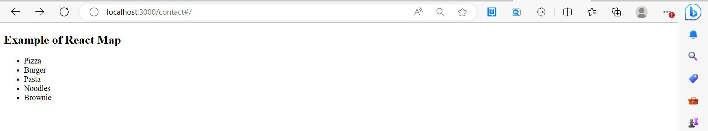

In the above example, we saw how we could use the map method on an array of strings called foodLists and return each array item to a new unordered list.

`Traverse a List of Elements Using Keys`

Now let us go through an example to see how we can traverse through the list of elements using keys.

`Example:`

```

import React from 'react';  
import ReactDOM from 'react-dom';  
function ListItem(props) {  
  return <li>{props.value}</li>;  
} 
function NumberList(props) {  
  const numbers = props.numbers;  
  const numberItems = numbers.map((number) =>  
    <ListItem key={number.toString()}  
              value={number} />  
  );  
  return (  
    <div>  
      <h2>Example of using React Map with keys</h2>  
          <ul> {numberItems} </ul>  
    </div>  
  );  
}  
const numbers = [1, 2, 3, 4, 5];  
ReactDOM.render(  
  <NumberList numbers={numbers} />,  
  document.getElementById('app')  
);  
export default App;

```

`Output:`

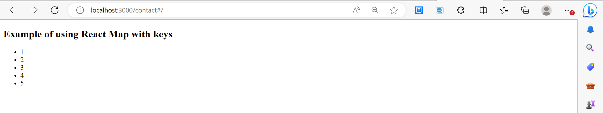

# React CSS

* CSS in React is used to style the React App or Component. 

* The style attribute is the most used attribute for styling in React applications, which adds dynamically-computed styles at render time. 

* It accepts a JavaScript object in camelCased properties rather than a CSS string. There are many ways available to add styling to your React App or Component with CSS. 

* Here, we are going to discuss mainly four ways to style React Components, which are given below:

1. Inline Styling

2. CSS Stylesheet

3. CSS Module

4. Styled Components

<br>

*  `Inline Styling:` In order to apply the inline styles to the elements, we use the style prop. We pass an object with key as CSS properties in camelCase and value as the values that can be assigned to these CSS properties.

`Syntax:` The syntax to assign inline styles to CSS elements is mentioned below.

```
<div style={{backgroundColor: 'red'}}></div>
```

`Example`

`App.js`

```

const App = () => {
  return (
    <div
      style={{
        display: "flex",
        alignItems: "center",
        justifyContent: "center",
        height: "100vh",
        backgroundImage:
          "linear-gradient(to right, #427ceb, #1dad6f)",
      }}
    >
      <h1 style={{ color: "white" }}>Welcome to React CSS</h1>
    </div>
  );
};

export default App;

```

`Output:`

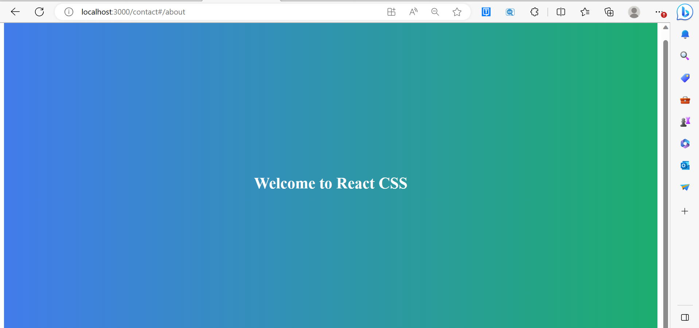

`camelCase Property Name`

If the properties have two names, like background-color, it must be written in camel case syntax.

`Example`

`App.js`

```
const App = () => {
  return (
    <div
      style={{
        display: "flex",
        flexDirection: "column", // This will stack the children vertically
        alignItems: "center",
        justifyContent: "center",
        height: "100vh",
        backgroundImage:
          "linear-gradient(to right, #427ceb, #1dad6f)",
      }}
    >
      <h1 style={{ color: "white" }}>Welcome to React CSS</h1>
      <p style={{ backgroundColor: "lightgreen" }}>Example for camelCase.</p>
    </div>
  );
};

export default App;

```

`Output:`

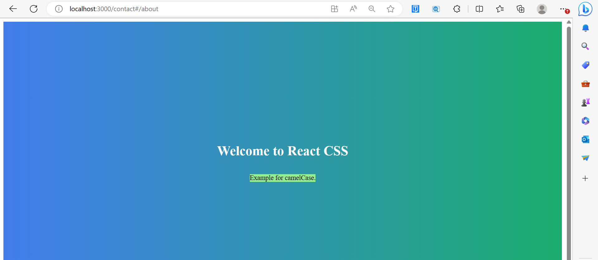

`Using JavaScript Object :` The inline styling also allows us to create an object with styling information and refer it in the style attribute.

`Example`

`App.js`

```

const App = () => {
  const containerStyle = {
    display: "flex",
    flexDirection: "column", // Stack children vertically
    alignItems: "center",
    justifyContent: "center",
    height: "100vh",
    backgroundImage: "linear-gradient(to right, #427ceb, #1dad6f)",
  };
  const headingStyle = {
    color: "white",
  };
  return (
    <div style={containerStyle}>
      <h1 style={headingStyle}>Welcome to React CSS</h1>
    </div>
  );
};

export default App;
 
```

`Output`


>Note: For all below-given examples, the output will remain as above only.

* `Styling using CSS file :` To style the React elements using the CSS file, we first import the CSS file and then assign the classes contained in the CSS file to the className prop of React elements. 
  
`Syntax:` The syntax to assign the classes to the className prop is mentioned below. 

```
<div className="name_of_the_class"></div>
```

`Filename:` App.js The content of App.js and App.css files demonstrating the use of CSS files to style React elements is mentioned below.

`Example:App.js`

```
import './App.css';
 
const App = () => {
    return (
        <div className='container-div'>
            <h1 className='heading'>Welcome to React CSS</h1>
        </div>
    );
};
 
export default App;
App.css
.container-div {
	display: flex;
	align-items: center;
	justify-content: center;
	height: 100vh;
	background-image: linear-gradient(to right, #427ceb, #1dad6f);
}

.heading {
	color: white;
}

```

* `Styling using CSS module :` CSS modules are a way to locally scope the content of your CSS file. We can create a CSS module file by naming our CSS file as App.modules.css and then it can be imported inside App.js file using the special syntax mentioned below.
  
`Syntax:`

```
import styles from './App.module.css';
Now we can easily assign the classes to the className properties mentioned below.
<div className={styles['container-div']}> 
    <h1 className={styles.heading}>GeeksForGeeks</h1>
</div>

```

The square bracket is used to access the class when it contains a hyphen or we can use it generally also. The dot can be used to access the class when it does not contain a hyphen. 

`Filename:` App.js The content of App.js and App.css files demonstrating the use of CSS modules to style the React element is mentioned below.

`App.js`

```
import styles from './App.module.css';

const App = () => {
	return (
		<div className={styles['container-div']}>
			<h1 className={styles.heading}>Welcome to React CSS</h1>
		</div>
	);
};
export default App;
App.modules.css
.container-div {
	display: flex;
	align-items: center;
	justify-content: center;
	height: 100vh;
	background-image: linear-gradient(
		to right, #427ceb, #1dad6f);
}

.heading {
	color: white;
}

```

* `Styling using styled-components :` The styled-components is a third-party package that helps us create a new Styled component based on the React element and CSS styles provided to it. 
  
`Module Installation:` In order to use the styled-components you must first install it as a dependency using the following command from the command line.

```
npm install styled-components

```

`Syntax:` To create a styled component you can use the syntax mentioned below.

```
import styled from 'styled-components';
const WelcomeHeading = styled.h1`
  color: white;
`;

```

The code above will create a new component based on the h1 element and style it with the CSS properties passed to it. The content of the App.js file demonstrating the use of styled-components is mentioned below.

`Example:`

```
import styled from 'styled-components';

const PageDiv = styled.div`
display: flex;
align-items: center;
justify-content: center;
height: 100vh;
background-image: linear-gradient(
  to right, #427ceb, #1dad6f);
`;

const WelcomeHeading = styled.h1`
color: white;
`;

const App = () => {
  return (
    <PageDiv>
      <WelcomeHeading>Welcome to React CSS</WelcomeHeading>
    </PageDiv>
  );
};

export default App;

```


# React Animation

* The animation is a technique in which images are manipulated to appear as moving images. 

* It is one of the most used technique to make an interactive web application. 

* In React, we can add animation using an explicit group of components known as the React Transition Group.

* React Transition Group is an add-on component for managing component states and useful for defining entering and exiting transitions. 

* It is not able to animate styles by itself. Instead, it exposes transition states manages classes and group elements, and manipulates the DOM in useful ways. 

* It makes the implementation of visual transitions much easier.

* React Transition group has mainly two APIs to create transitions. These are:

1. ReactTransitionGroup: It uses as a low-level API for animation.
2. ReactCSSTransitionGroup: It uses as a high-level API for implementing basic CSS transitions and animations.

`Installation`

We need to install react-transition-group for creating animation in React Web application. You can use the below command.

```

$ npm install react-transition-group --save  

```

`React Transition Group Components`

React Transition Group API provides three main components. These are:

1. Transition
2. CSSTransition
3. Transition Group


1. `Transition`

* It has a simple component API to describe a transition from one component state to another over time. 

* It is mainly used to animate the mounting and unmounting of a component. 

* It can also be used for in-place transition states as well.

We can access the Transition component into four states:

* entering

* entered

* exiting

* exited


2. `CSSTransition`

* The CSSTransition component uses CSS stylesheet classes to write the transition and create animations. 

* It is inspired by the ng-animate library. 

* It can also inherit all the props of the transition component. 

We can divide the "CSSTransition" into three states. These are:

* Appear

* Enter

* Exit

CSSTransition component must be applied in a pair of class names to the child components. The first class is 
in the form of name-stage and the second class is in the name-stage-active. For example, you provide the name 
fade, and when it applies to the 'enter' stage, the two classes will be fade-enter and fade-enter-active. It 
may also take a prop as Timeout which defines the maximum time to animate.


3. `TransitionGroup`

* This component is used to manage a set of transition components (Transition and CSSTransition) in a list.
   
* It is a state machine that controls the mounting and unmounting of components over time. 

* The Transition component does not define any animation directly. 

* Here, how 'list' item animates is based on the individual transition component. 

* It means, the "TransitionGroup" component can have different animation within a component.

Let us see the example below, which clearly help to understand the React Animation.

`Example:`

`App.js`

In the App.js file, import react-transition-group component, and create the CSSTransition component that uses
as a wrapper of the component you want to animate. We are going to use transitionEnterTimeout and transitionLeaveTimeout for CSS Transition. The Enter and Leave animations used when we want to insert or delete elements from the list.

```

import React, { Component } from 'react';  
import { CSSTransitionGroup } from 'react-transition-group';  
  
class App extends React.Component {  
    constructor(props) {  
    super(props);  
    this.state = {items: ['Blockchain', 'ReactJS', 'TypeScript', 'JavaTpoint']};  
    this.handleAdd = this.handleAdd.bind(this);  
  }  
  
  handleAdd() {  
    const newItems = this.state.items.concat([  
      prompt('Enter Item Name')  
    ]);  
    this.setState({items: newItems});  
  }  
  
  handleRemove(i) {  
    let newItems = this.state.items.slice();  
    newItems.splice(i, 1);  
    this.setState({items: newItems});  
  }  
  
  render() {  
    const items = this.state.items.map((item, i) => (  
      <div key={item} onClick={() => this.handleRemove(i)}>  
        {item}  
      </div>  
    ));  
  
    return (  
      <div>  
    <h1>Animation Example</h1>  
            <button onClick={this.handleAdd}>Insert Item</button>  
            <CSSTransitionGroup  
               transitionName="example"  
           transitionEnterTimeout={800}  
               transitionLeaveTimeout={600}>  
               {items}  
            </CSSTransitionGroup>  
      </div>  
    );  
  }  
}  
export default App;  
```

`Main.js`

```

import React from 'react';  
import ReactDOM from 'react-dom';  
import App from './App.js';  
  
ReactDOM.render(<App />, document.getElementById('app'));  
```

`style.css`

Add style.css file in your application, and add the following CSS styles. Now, to use this CSS file, you need to add the link of this file in your HTML file.

```css

.example-enter {  
  opacity: 0.01;  
}  
  
.example-enter.example-enter-active {  
  opacity: 1;  
  transition: opacity 500ms ease-in;  
}  
  
.example-leave {  
  opacity: 1;  
}  
  
.example-leave.example-leave-active {  
  opacity: 0.01;  
  transition: opacity 300ms ease-in;  
}  
```

In the above example, the animation durations are specified in both the CSS and render method. It tells React component when to remove the animation classes from the list and if it is leaving when to remove the element 
from the DOM.

`Output:`

When we execute the above program, it gives the below output.

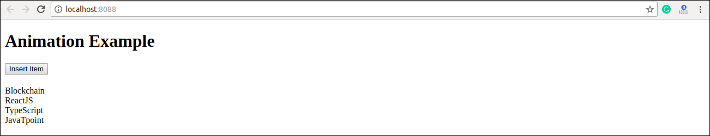

Click on 'Insert Item' button, the following screen appears.

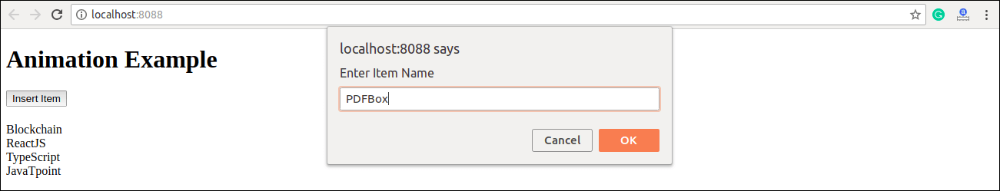

Once we insert the item and press Ok, the new item can be added in the list with fade in style. Here, we can also delete any item from the list by clicking on the particular link.

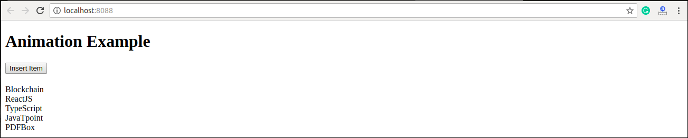

# React Bootstrap

Single-page applications gaining popularity over the last few years, so many front-end frameworks have introduced such as Angular, React, Vue.js, Ember, etc. As a result, jQuery is not a necessary requirement for 
building web apps. Today, React has the most used JavaScript framework for building web applications, and
Bootstrap become the most popular CSS framework. So, it is necessary to learn various ways in which Bootstrap can be used in React apps, which is the main aim of this section.


`Adding Bootstrap for React`

We can add Bootstrap to the React app in several ways. The three most common ways are given below:

1. Using the Bootstrap CDN
2. Bootstrap as Dependency
3. React Bootstrap Package

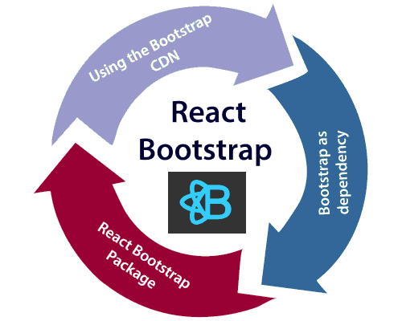


1. `Using the Bootstrap CDN`

It is the easiest way of adding Bootstrap to the React app. There is no need to install or download Bootstrap. We can simply put an `<link>` into the `<head>` section of the index.html file of the React app as shown in the following snippet.

```htm
<link rel="stylesheet" href="https://stackpath.bootstrapcdn.com/bootstrap/4.3.1/css/bootstrap.min.css" integrity="sha384-ggOyR0iXCbMQv3Xipma34MD+dH/1fQ784/j6cY/iJTQUOhcWr7x9JvoRxT2MZw1T" crossorigin="anonymous">  
```

If there is a need to use Bootstrap components which depend on JavaScript/jQuery in the React application, we need to include jQuery, Popper.js, and Bootstrap.js in the document. Add the following imports in the 

`<script>` tags near the end of the closing </body> tag of the index.html file.

```htm
<script src="https://code.jquery.com/jquery-3.3.1.slim.min.js" integrity="sha384-q8i/X+965DzO0rT7abK41JStQIAqVgRVzpbzo5smXKp4YfRvH+8abtTE1Pi6jizo" crossorigin="anonymous"></script>  
  
<script src="https://cdnjs.cloudflare.com/ajax/libs/popper.js/1.14.7/umd/popper.min.js" integrity="sha384-UO2eT0CpHqdSJQ6hJty5KVphtPhzWj9WO1clHTMGa3JDZwrnQq4sF86dIHNDz0W1" crossorigin="anonymous"></script>  
  
<script src="https://stackpath.bootstrapcdn.com/bootstrap/4.3.1/js/bootstrap.min.js" integrity="sha384-JjSmVgyd0p3pXB1rRibZUAYoIIy6OrQ6VrjIEaFf/nJGzIxFDsf4x0xIM+B07jRM" crossorigin="anonymous"></script> 
```

In the above snippet, we have used jQuery's slim version, although we can also use the full version as well.Now, Bootstrap is successfully added in the React application, and we can use all the CSS utilities and UI components available from Bootstrap in the React application.


2. `Bootstrap as Dependency`

If we are using a build tool or a module bundler such as Webpack, then importing Bootstrap as dependency is the preferred option for adding Bootstrap to the React application. We can install Bootstrap as a dependency for the React app. To install the Bootstrap, run the following commands in the terminal window.

```
npm install bootstrap --save  

```

Once Bootstrap is installed, we can import it in the React application entry file. If the React project created using the create-react-app tool, open the src/index.js file, and add the following code:

```markdown
import 'bootstrap/dist/css/bootstrap.min.css';  
```

Now, we can use the CSS classes and utilities in the React application. Also, if we want to use the JavaScript
components, we need to install the jquery and popper.js packages from npm. To install the following packages, run the following command in the terminal window.

```
npm install jquery popper.js  

```

Next, go to the src/index.js file and add the following imports.

```markdown

import $ from 'jquery';  
import Popper from 'popper.js';  
import 'bootstrap/dist/js/bootstrap.bundle.min';  
```

Now, we can use Bootstrap JavaScript Components in the React application.


3. `React Bootstrap Package`

The React Bootstrap package is the most popular way to add bootstrap in the React application. There are many
Bootstrap packages built by the community, which aim to rebuild Bootstrap components as React components. The two most popular Bootstrap packages are:

* `react-bootstrap:` It is a complete re-implementation of the Bootstrap components as React components. It does not need any dependencies like bootstrap.js or jQuery. If the React setup and React-Bootstrap installed, we have everything which we need.

* `reactstrap: `It is a library which contains React Bootstrap 4 components that favor composition and control. It does not depend on jQuery or Bootstrap JavaScript. However, react-popper is needed for advanced positioning of content such as Tooltips, Popovers, and auto-flipping Dropdowns.


`React Bootstrap Installation`

Let us create a new React app using the create-react-app command as follows.

```
npx create-react-app react-bootstrap-app  

```

After creating the React app, the best way to install Bootstrap is via the npm package. To install Bootstrap, 

navigate to the React app folder, and run the following command.

```
npm install react-bootstrap bootstrap --save  

```

`Importing Bootstrap`

Now, open the src/index.js file and add the following code to import the Bootstrap file.

```
import 'bootstrap/dist/css/bootstrap.min.css';  

```

We can also import individual components like import { SplitButton, Dropdown } from 'react-bootstrap'; instead of the entire library. It provides the specific components which we need to use, and can significantly reduce the amount of code.

In the React app, create a new file named ThemeSwitcher.js in the src directory and put the following code.

```markdown
import React, { Component } from 'react';  
import { SplitButton, Dropdown } from 'react-bootstrap';  
  
class ThemeSwitcher extends Component {  
  
  state = { theme: null }  
    
  chooseTheme = (theme, evt) => {  
    evt.preventDefault();  
    if (theme.toLowerCase() === 'reset') { theme = null }  
    this.setState({ theme });  
  }  
    
  render() {  
    const { theme } = this.state;  
    const themeClass = theme ? theme.toLowerCase() : 'default';  
      
    const parentContainerStyles = {  
      position: 'absolute',  
      height: '100%',  
      width: '100%',  
      display: 'table'  
    };  
      
    const subContainerStyles = {  
      position: 'relative',  
      height: '100%',  
      width: '100%',  
      display: 'table-cell',  
    };  
      
    return (  
      <div style={parentContainerStyles}>  
        <div style={subContainerStyles}>  
          
          <span className={`h1 center-block text-center text-${theme ? themeClass : 'muted'}`} style={{ marginBottom: 25 }}>{theme || 'Default'}</span>  
            
          <div className="center-block text-center">  
            <SplitButton bsSize="large" bsStyle={themeClass} title={`${theme || 'Default Block'} Theme`}>  
              <Dropdown.Item eventKey="Primary Block" onSelect={this.chooseTheme}>Primary Theme</Dropdown.Item>  
              <Dropdown.Item eventKey="Danger Block" onSelect={this.chooseTheme}>Danger Theme</Dropdown.Item>  
              <Dropdown.Item eventKey="Success Block" onSelect={this.chooseTheme}>Success Theme</Dropdown.Item>  
              <Dropdown.Item divider />  
              <Dropdown.Item eventKey="Reset Block" onSelect={this.chooseTheme}>Default Theme</Dropdown.Item>  
            </SplitButton>  
          </div>    
        </div>  
      </div>  
    );   
  }   
}  
export default ThemeSwitcher;  
```

Now, update the src/index.js file with the following snippet.

`App.js`

```markdown
import 'bootstrap/dist/css/bootstrap.min.css';  
import React from 'react';  
import ReactDOM from 'react-dom';  
import App from './App.js';  
import './index.css';  
import ThemeSwitcher from './ThemeSwitcher';  
  
ReactDOM.render(<ThemeSwitcher />, document.getElementById('root'));  
```

`Output:`

When we execute the React app, we should get the output as below.

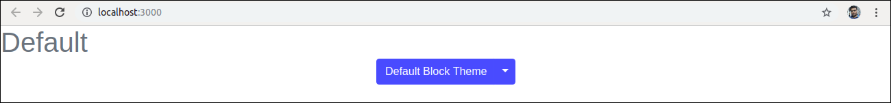

Click on the dropdown menu. We will get the following screen.

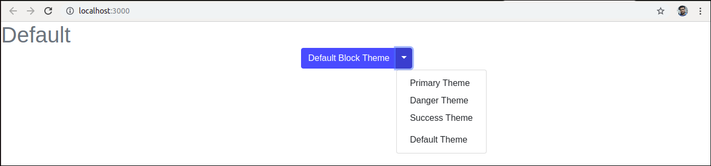

Now, if we choose the Success Theme, we will get the below screen.

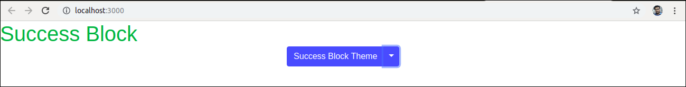


`Using reactstrap`

Let us create a new React app using the create-react-app command as follows.

```
npx create-react-app reactstrap-app  

```

Next, install the reactstrap via the npm package. To install reactstrap, navigate to the React app folder, 

and run the following command.

```
npm install bootstrap reactstrap --save  
```


`Importing Bootstrap`

Now, open the src/index.js file and add the following code to import the Bootstrap file.

```
import 'bootstrap/dist/css/bootstrap.min.css'; 
```

# React Table

* A table is an arrangement which organizes information into rows and columns. It is used to store and display data in a structured format.

* The react-table is a lightweight, fast, fully customizable (JSX, templates, state, styles, callbacks), and extendable Datagrid built for React. It is fully controllable via optional props and callbacks.

`Features`

*  It is lightweight at 11kb (and only need 2kb more for styles).

*  It is fully customizable (JSX, templates, state, styles, callbacks).

*  It is fully controllable via optional props and callbacks.

*  It has client-side & Server-side pagination.

*  It has filters.

*  Pivoting & Aggregation

*  Minimal design & easily themeable


`Installation`

Let us create a React app using the following command.

```
npx create-react-app myreactapp  
```

Next, we need to install react-table. We can install react-table via npm command, which is given below.

```
$ npm install react-table  
```

Once, we have installed react-table, we need to `import` the react-table into the react component. To do this, open the src/App.js file and add the following snippet.

```
import ReactTable from "react-table";  
```

`Example 1:` Here `App.js` is the default component. At first, we will see how to create a table using the
hardcoded values. Later we will see how to dynamically render the data from an array inside the table. 


`Filename: App.js`


```markdown

import './App.css';
  
function App() {
  return (
    <div className="App">
      <table>
        <tr>
          <th>Name</th>
          <th>Age</th>
          <th>Gender</th>
        </tr>
        <tr>
          <td>Anom</td>
          <td>19</td>
          <td>Male</td>
        </tr>
        <tr>
          <td>Megha</td>
          <td>19</td>
          <td>Female</td>
        </tr>
        <tr>
          <td>Subham</td>
          <td>25</td>
          <td>Male</td>
        </tr>
      </table>
    </div>
  );
}
  
export default App;
```

In the above example, we just simply used the HTML table elements which are `<table>`, `<tr>`, `<th>`, and `<td> `
elements. 

`Example 2:` Now lets us see how we can dynamically render data from an array. Instead of manually iterating
over the array using a loop, we can simply use the inbuilt Array.map() method. The Array.map() method allows you to iterate over an array and modify its elements using a callback function. The callback function will then be executed on each of the array’s elements. In this case, we will just return a table row on each iteration.


`Filename: App.js`

```markdown

import './App.css';
  
// Example of a data array that
// you might receive from an API
const data = [
  { name: "Anom", age: 19, gender: "Male" },
  { name: "Megha", age: 19, gender: "Female" },
  { name: "Subham", age: 25, gender: "Male"},
]
  
function App() {
  return (
    <div className="App">
      <table>
        <tr>
          <th>Name</th>
          <th>Age</th>
          <th>Gender</th>
        </tr>
        {data.map((val, key) => {
          return (
            <tr key={key}>
              <td>{val.name}</td>
              <td>{val.age}</td>
              <td>{val.gender}</td>
            </tr>
          )
        })}
      </table>
    </div>
  );
}
  
export default App;
```

`Filename:` App.css Now, let’s edit the file named App.css to style the table.

```css
.App {
  width: 100%;
  height: 100vh;
  display: flex;
  justify-content: center;
  align-items: center;
}
  
table {
  border: 2px solid forestgreen;
  width: 800px;
  height: 200px;
}
  
th {
  border-bottom: 1px solid black;
}
  
td {
  text-align: center;
}
```

`Output:`

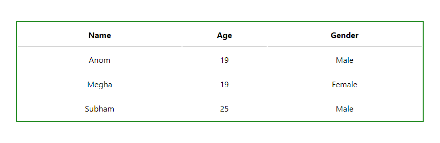


# React Code Splitting

* First you need to understand how most frameworks work.

* Since many bundle all dependencies into one large file, which makes it easy to add JavaScript to an HTML page.

* In theory, bundling JavaScript in this way should speed up page loading and reduce the amount of traffic pages have to handle.

* But as an application grows, the size of its bundles also grows and, at some point, its bundles will be so large that they will take a long time to load.

* This is where the code splitting technique comes in. Code splitting consists of separating the code into several packages or components that can be loaded on demand or in parallel. This means that they are not loaded until they are needed.


`The benefits of code splitting are:`

* The speed at which a website loads and displays content becomes faster.

* The interaction time improves.

* The percentage of users who abandon the web page without interacting with it decreases.


`Drawback of code splitting:`

* Although you may not realize it, code splitting requires downloading some data after the page is initialized.

* When the internet connection is down, additional modules cannot be loaded. You need to ensure the user receives an appropriate message in this situation.

* Additional logic is required to load multiple modules when needed.

* To inject each of the bundles into the application, it is necessary to have a header file.

* As a result, loading additional code chunks causes a slight delay (especially when the page or website is
 loading for the first time).


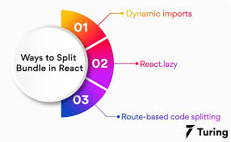

1. `Dynamic imports`

Perhaps the simplest way to split code in React is with the dynamic “import” syntax. Some bundlers can parse dynamic import statements natively, while others require some configuration. The dynamic import syntax works for both static site generation and server-side rendering.Dynamic imports use the then function to import only the code that is needed. Any call to the imported code must be inside that function.

```markdown

import("./parseText").then(parseText => {
  console.log(parseText.count("This is a text string", "text"));
});
```

2. `React.lazy`

React.lazy allows for lazy loading of imports in many contexts. It is not yet available for server-side rendering, but its diversity of functions makes up for that. The React.lazy function allows you to dynamically import a dependency and render that dependency as a component in a single line of code. The component must be rendered inside another component that shows fallback content if the dynamic import fails.This can include error content, although this is not required. If error content is included, it must be included in a special type of component called an Error Boundary. The Error Boundary component must be above any components that are dynamically loaded to make sure they display properly.


**Before**

```markdown

import ExampleComponent from './ExampleComponent';  
  
function MyComponent() {  
  return (  
    <div>  
      <ExampleComponent />  
    </div>  
  );  
}
```  


**After**

```markdown
const ExampleComponent = React.lazy(() => import('./ExampleComponent'));  
  
function MyComponent() {  
  return (  
    <div>  
      <ExampleComponent />  
    </div>  
  );  
} 
``` 


3. `Suspense`

If the module which contains the ExampleComponent is not yet loaded by the function component(MyComponent), then we need to show some fallback content while we are waiting for it to load. We can do this using the suspense component. In other words, the suspense component is responsible for handling the output when the lazy component is fetched and rendered.

```

const ExampleComponent = React.lazy(() => import('./ ExampleComponent'));  
  
function MyComponent() {  
  return (  
    <div>  
      <Suspense fallback={<div>Loading...</div>}>  
        <ExampleComponent />  
      </Suspense>  
    </div>  
  );  
}  
```

The fallback prop accepts the React elements which you want to render while waiting for the component to load. We can combine multiple lazy components with a single Suspense component. It can be seen in the below example.

```

const ExampleComponent = React.lazy(() => import('./ ExampleComponent'));  
const ExamComponent = React.lazy(() => import('./ ExamComponent'));  
  
function MyComponent() {  
  return (  
    <div>  
      <Suspense fallback={<div>Loading...</div>}>  
        <section>  
          <ExampleComponent />  
          <ExamComponent />  
        </section>  
      </Suspense>  
    </div>  
  );  
}  
```

>**Note:** React.lazy and Suspense components are not yet available for server-side rendering. For code-splitting in a server-rendered app, it is recommended to use Loadable Components.


4. `Error boundaries`

If any module fails to load, for example, due to network failure, we will get an error. We can handle these errors with Error Boundaries. Once we have created the Error Boundary, we can use it anywhere above our lazy components to display an error state.

```

import MyErrorBoundary from './MyErrorBoundary';  
const ExampleComponent = React.lazy(() => import('./ ExampleComponent'));  
const ExamComponent = React.lazy(() => import('./ ExamComponent'));  
  
const MyComponent = () => (  
  <div>  
    <MyErrorBoundary>  
      <Suspense fallback={<div>Loading...</div>}>  
        <section>  
          <ExampleComponent />  
          <ExamComponent />  
        </section>  
      </Suspense>  
    </MyErrorBoundary>  
  </div>  
);  
```


5. `Route-based code splitting`

It is very tricky to decide where we introduce code splitting in the app. For this, we have to make sure that we choose the place which will split the bundles evenly without disrupting the user experience.The route is the best place to start the code splitting. Route based code splitting is essential during the page transitions on the web, which takes some amount of time to load. Here is an example of how to setup route-based code splitting into the app using React Router with React.lazy.

```markdown

import { Switch, BrowserRouter as Router, Route} from 'react-router-dom';  
import React, { Suspense, lazy } from 'react';  
  
const Home = lazy(() => import('./routes/Home'));  
const About = lazy(() => import('./routes/About'));  
const Contact = lazy(() => import('./routes/Contact'));  
  
const App = () => (  
  <Router>  
    <Suspense fallback={<div>Loading...</div>}>  
      <Switch>  
        <Route exact path="/" component={Home}/>  
        <Route path="/about" component={About}/>  
        <Route path="/contact" component={Contact}/>  
      </Switch>  
    </Suspense>  
  </Router>  
);  
```


6. `Named Export`

Currently, React.lazy supports default exports only. If any module you want to import using named exports, you need to create an intermediate module that re-exports it as the default. We can understand it from the below example.


`ExampleComponents.js`

```markdown
export const MyFirstComponent = /* ... */;  
export const MySecondComponent = /* ... */;  
```


`MyFirstComponent.js`

```markdown
export { MyFirstComponent as default } from "./ExampleComponents.js";  
```


`MyApp.js`

```markdown
import React, { lazy } from 'react';  
const MyFirstComponent = lazy(() => import("./MyFirstComponent.js"));  
```

# React Context API

The React Context API is a component structure, which allows us to share data across all levels of the application. The main aim of Context API is to solve the problem of prop drilling (also called "Threading"). 

The Context API in React are given below.

* React.createContext

* Context.provider

* Context.Consumer

* Class.contextType

1.`React.createContext`

It creates a context object. When React renders a component which subscribes to this context object, then it 

will read the current context value from the matching provider in the component tree.


`Syntax`

```markdown
const MyContext = React.createContext(defaultValue);  
```

When a component does not have a matching Provider in the component tree, it returns the defaultValue argument. It is very helpful for testing components isolation (separately) without wrapping them.


2. `Context.Provider`

Every Context object has a Provider React component which allows consuming components to subscribe to context changes. It acts as a delivery service. When a consumer component asks for something, it finds it in the context and provides it to where it is needed.


`Syntax`

```markdown
<MyContext.Provider value={/* some value */}>  
```

It accepts the value prop and passes to consuming components which are descendants of this Provider. We can connect one Provider with many consumers. Context Providers can be nested to override values deeper within the component tree. All consumers that are descendants of a Provider always re-render whenever the Provider's value prop is changed. The changes are determined by comparing the old and new values using the same algorithm as Object.is algorithm.


3. `Context.Consumer`

It is the React component which subscribes to the context changes. It allows us to subscribe to the context within the function component. It requires the function as a component. A consumer is used to request data through the provider and manipulate the central data store when the provider allows it.


`Syntax`

```markdown
<MyContext.Consumer>  
       {value => /* render something which is based on the context value */}  
</MyContext.Consumer> 
``` 

The function component receives the current context value and then returns a React node. The value argument which passed to the function will be equal to the value prop of the closest Provider for this context in the component tree. If there is no Provider for this context, the value argument will be equal to the defaultValue which was passed to createContext().


4. `Class.contextType`

The contextType property on a class used to assign a Context object which is created by React.createContext(). It allows you to consume the closest current value of that Context type using this.context. We can reference this in any of the component life-cycle methods, including the render function.

>Note: We can only subscribe to a single context using this API. If we want to use the experimental public class field's syntax, we can use a static class field to initialize the contextType.


`React Context API Example`

`Step1` Create a new React app using the following command.

```
npx create-react-app mycontextapi  
```

`Step2` Install bootstrap CSS framework using the following command.

```
npm install react-bootstrap bootstrap --save    
```

`Step3` Add the following code snippet in the src/APP.js file.


```markdown
import React, { Component } from 'react';  
import 'bootstrap/dist/css/bootstrap.min.css';  
  
const BtnColorContext = React.createContext('btn btn-darkyellow');  
  
class App extends Component {  
  render() {  
    return (  
      <BtnColorContext.Provider value="btn btn-info">  
        <Button />  
      </BtnColorContext.Provider>  
    );  
  }  
}  
  
function Button(props) {  
  return (  
  <div className="container">  
    <ThemedButton />      
  </div>  
  );  
}  
  
class ThemedButton extends Component {  
    
  static contextType = BtnColorContext;  
  render() {  
    return <button className={this.context} >  
      welcome to javatpoint  
    </button>;  
  }  
}  
export default App;  
```

In the above code snippet, we have created the context using React.createContext(), which returns the Context
object. After that, we have created the wrapper component which returns the Provider component, and then add all the elements as children from which we want to access the context.


`Output:`

When we run the React app, we will get the following screen.


# React Hooks

`What are Hooks?`

Hooks are used to give functional components an access to use the states and are used to manage side-effects in React. They were introduced React 16.8. They let developers use state and other React features without writing a class For example- State of a component It is important to note that hooks are not used inside the classes.

>Note: Hooks cannot be used with class components

`When to use a Hooks`

If you write a function component, and then you want to add some state to it, previously you do this by converting it to a class. But, now you can do it by using a Hook inside the existing function component.

`Rules for using hooks`

*	Only functional components can use hooks

*	Calling of hooks should always be done at top level of components

*	Hooks should not be inside conditional statements

`Benefits with React Hooks`

* `Easy−to−understand complex components:`In the past, the developers had to maintain parts that at first were straightforward but eventually turned into an unmanageable jumble of stateful logic. As a result, getting errors and inconsistencies became a normal thing. Instead of requiring a split based on lifecycle methods, hooks allow you to divide a single component into separate functions based on how its constituent parts are related.


* `Reduced Complexity without Classes (with functions!):`Learning React can be quite difficult because of classes. Props, state, and the downward data flow are concepts that people can grasp very well, but still have difficulty understanding in classes. Even among seasoned React developers, arguments over the distinction between function and class components can be seen frequently.
  
  Contrarily, hooks allow you to embrace functions and use more React capabilities without the need to understand intricate functional or reactive programming techniques.


* `Easy to reuse Stateful Logic:`You can remove stateful logic from a component using hooks so that it can be tested separately and used again. You can reuse stateful logic with hooks without altering the component structure which was very difficult earlier even the higher−order components and render props couldn’t manage to do it Sharing Hooks amongst numerous components or with the community is now way too simple.


* **Rules of Hooks**:Hooks are similar to JavaScript functions, but you need to follow these two rules when using them. Hooks rule ensures that all the stateful logic in a component is visible in its source code. These rules are:-


1. **Only call Hooks at the top level**
Do not call Hooks inside loops, conditions, or nested functions. Hooks should always be used at the top level of the React functions. This rule ensures that Hooks are called in the same order each time a components renders.


2. **Only call Hooks from React functions**
You cannot call Hooks from regular JavaScript functions. Instead, you can call Hooks from React function components. Hooks can also be called from custom Hooks.

**Important things to remember while using hooks:**

*	Hooks are available for React version 16.8 or higher.

*	Hooks are completely opt-in. Use it partially for a few components or base the whole project on it as per your needs without rewriting any existing code.

*	Hooks don’t contain any breaking changes and are 100% backward-compatible.

*	The react team has no plan to remove classes from React.

*	Hooks can’t be used inside class components but the app can definitely mix class-based components and functional components with Hooks.

*	Hooks doesn’t violate any existing React concepts. Instead, Hooks provide a direct API to react concepts such as props, state, context, refs and life-cycle.


**Pre-requisites for React Hooks**

1. Node version 6 or above

2. NPM version 5.2 or above

3. Create-react-app tool for running the React App

**React Hooks Installation**

To use React Hooks, we need to run the following commands:

```markdown
$ npm install react@16.8.0-alpha.1 --save  

$ npm install react-dom@16.8.0-alpha.1 --save  
```

The above command will install the latest React and React-DOM alpha versions which support React Hooks. Make 

sure the package.json file lists the React and React-DOM dependencies as given below.

```json
"react": "^16.8.0-alpha.1",  

"react-dom": "^16.8.0-alpha.1",  
```

## useState

This hook lets you add state to your functional components. It returns a state variable and a function to update that variable.so basically useState is the ability to encapsulate local state in a functional component.  The  useState hook is a special function that takes the initial state as an argument and returns an array of two entries.  UseState encapsulate only singular value from the state, for multiple state need to have useState calls.


**Syntax: **

The first element is the initial state and the second one is a function that is used for updating the state.

```markdown
const [state, setState] = useState(initialstate)
```

We can also pass a function as an argument if the initial state has to be computed. And the value returned by the function will be used as the initial state.

```markdown
const [sum, setsum] = useState(function generateRandomInteger(){5+7);})
```

The above function is oneline function which computes the sum of two numbers and will be set as the initial state.


**Importing:**

To use useState you need to import useState from react as shown below:

```markdown
import React, { useState } from "react"
```


**Example:**

Below is the implementation of useState() function.

```markdown
import React, { useState } from "react";

function App(props) {
const [count, setRandomCount] =
	useState(function generateRandomInteger() {
	return Math.floor(Math.random() * 100);
});
function clickHandler(e) {
	setRandomCount(Math.floor(Math.random() * 100));
}
return (
	<div style={{margin: 'auto', width: 100, display: 'block'}}>
	<h1> {count} </h1>
	
	
<p>
		<button onClick={clickHandler}> Click </button>
	</p>


	</div>
);
}

export default App
```

**Output:**


>when we click button it will prints the random number

## useEffect

The Effect Hook allows us to perform side effects (an action) in the function components. It does not use components lifecycle methods which are available in class components. In other words, Effects Hooks are equivalent to componentDidMount(), componentDidUpdate(), and componentWillUnmount() lifecycle methods.

Side effects have common features which the most web applications need to perform, such as:

1. Updating the DOM,

2. Fetching and consuming data from a server API,

3. Setting up a subscription, etc.


**Example:**

```markdown
import { useState, useEffect } from "react";
import ReactDOM from "react-dom/client";

function Counter() {
  const [count, setCount] = useState(0);
  const [calculation, setCalculation] = useState(0);

  useEffect(() => {
    setCalculation(() => count * 2);
  }, [count]); // <- add the count variable here

  return (
    <>
      <p>Count: {count}</p>
      <button onClick={() => setCount((c) => c + 1)}>+</button>
      <p>Calculation: {calculation}</p>
    </>
  );
}

const root = ReactDOM.createRoot(document.getElementById('root'));
root.render(<Counter />);
```


**Output:**


**In React component, there are two types of side effects:**

1. Effects Without Cleanup

2. Effects With Cleanup

**Effects without Cleanup**

It is used in useEffect which does not block the browser from updating the screen. It makes the app more responsive. The most common example of effects which don't require a cleanup are manual DOM mutations, Network requests, Logging, etc.


**Effects with Cleanup**

Some effects require cleanup after DOM updation. For example, if we want to set up a subscription to some external data source, it is important to clean up memory so that we don't introduce a memory leak. React performs the cleanup of memory when the component unmounts. However, as we know that, effects run for every render method and not just once. Therefore, React also cleans up effects from the previous render before running the effects next time.


**Example:**

```markdown
import { useState, useEffect } from "react";
import ReactDOM from "react-dom/client";

function Timer() {
  const [count, setCount] = useState(0);

  useEffect(() => {
    let timer = setTimeout(() => {
    setCount((count) => count + 1);
  }, 1000);

  return () => clearTimeout(timer)
  }, []);

  return <h1>I've rendered {count} times!</h1>;
}

const root = ReactDOM.createRoot(document.getElementById('root'));
root.render(<Timer />);
```

**Output:**


## useContext

Context provides a way to pass data or state through the component tree without having to pass props down 

manually through each nested component. It is designed to share data that can be considered as global data 

for a tree of React components, such as the current authenticated user or theme(e.g. color, paddings, 

margins, font-sizes).

Context API uses Context. Provider and Context. Consumer Components pass down the data but it is very 

cumbersome to write the long functional code to use this Context API. So useContext hook helps to make the 

code more readable, less verbose and removes the need to introduce Consumer Component. The useContext hook is 

the new addition in React 16.8. 

<!--style="font-size:20px"-->
Syntax:

```markdown
const authContext = useContext(initialValue);
```

The useContext accepts the value provided by React.createContext and then re-render the component whenever 

its value changes but you can still optimize its performance by using memoization.

<!--style="font-size:20px"-->
Example: 

In this example, we are going to build an authentication React application that logs in or logs out users in 

the children component and updates the state accordingly.

We will build an App Component which has two LogIn and LogOut Components which access the state provided by 

the Context Provider and updates it accordingly.


AuthContext.js

```markdown
import React from 'react';

const authContext = React.createContext({
   auth: null,
   login: () => {},
   logout: () => {},
});
export default authContext;
```


App.js 


```markdown
import React, { useState } from 'react';
import LogIn from './Login';
import LogOut from './Logout';
import AuthContext from './AuthContext';

const App = () => {
   const [auth, setAuth] = useState(false);
   const login = () => {
      setAuth(true);
   };
   const logout = () => {
      setAuth(false);
   };
   return (
      <React.Fragment>
      <AuthContext.Provider
            value={{ auth: auth, login: login, logout: logout }}
      >
      <p>{auth ? 'Hi! You are Logged In' : 'Oope! Kindly Login'}</p>
      <LogIn />
      <LogOut />
      </AuthContext.Provider>
      </React.Fragment>
   );
};
export default App;
```


Login.js

```json
import React, { useContext } from 'react';
import AuthContext from './AuthContext';

const Login = () => {
   const auth = useContext(AuthContext);
   return (
      <>
         <button onClick={auth.login}>Login</button>
      </>
   );
};
export default Login;
```

Logout.js

```markdown
import React, { useContext } from 'react';
import AuthContext from './AuthContext';

const Logout = () => {
   const auth = useContext(AuthContext);
   return (
      <>
         <button onClick={auth.logout}>Click To Logout</button>
      </>
   );
};
export default Logout;
```

<!--style="font-size:30px"-->
Output


## useRef

The useRef Hook allows you to persist values between renders.

It can be used to store a mutable value that does not cause a re-render when updated.

It can be used to access a DOM element directly.

<!--style="font-size:30px"-->
Does Not Cause Re-renders

If we tried to count how many times our application renders using the useState Hook, we would be caught in an 

infinite loop since this Hook itself causes a re-render.

To avoid this, we can use the useRef Hook.

<!--style="font-size:20px"-->
Example:

Use useRef to track application renders.

```markdown
import { useState, useEffect, useRef } from "react";
import ReactDOM from "react-dom/client";

function App() {
  const [inputValue, setInputValue] = useState("");
  const count = useRef(0);

  useEffect(() => {
    count.current = count.current + 1;
  });

  return (
    <>
      <input
        type="text"
        value={inputValue}
        onChange={(e) => setInputValue(e.target.value)}
      />
      <h1>Render Count: {count.current}</h1>
    </>
  );
}

const root = ReactDOM.createRoot(document.getElementById('root'));
root.render(<App />);
```
<!--style="font-size:30px"-->
Output


useRef() only returns one item. It returns an Object called current.

When we initialize useRef we set the initial value: useRef(0).

It's like doing this: const count = {current: 0}. We can access the count by using count.current.

Run this on your computer and try typing in the input to see the application render count increase.

<!--style="font-size:30px"-->
Accessing DOM Elements

In general, we want to let React handle all DOM manipulation.

But there are some instances where useRef can be used without causing issues.

In React, we can add a ref attribute to an element to access it directly in the DOM.

<!--style="font-size:20px"-->
Example:

Use useRef to focus the input:

```markdown
import { useRef } from "react";
import ReactDOM from "react-dom/client";

function App() {
  const inputElement = useRef();

  const focusInput = () => {
    inputElement.current.focus();
  };

  return (
    <>
      <input type="text" ref={inputElement} />
      <button onClick={focusInput}>Focus Input</button>
    </>
  );
}

const root = ReactDOM.createRoot(document.getElementById('root'));
root.render(<App />);
```

<!--style="font-size:30px"-->
Output


<!--style="font-size:30px"-->
Tracking State Changes

The useRef Hook can also be used to keep track of previous state values.

This is because we are able to persist useRef values between renders.

<!--style="font-size:20px"-->
Example:

Use useRef to keep track of previous state values:

```markdown
import { useState, useEffect, useRef } from "react";
import ReactDOM from "react-dom/client";

function App() {
  const [inputValue, setInputValue] = useState("");
  const previousInputValue = useRef("");

  useEffect(() => {
    previousInputValue.current = inputValue;
  }, [inputValue]);

  return (
    <>
      <input
        type="text"
        value={inputValue}
        onChange={(e) => setInputValue(e.target.value)}
      />
      <h2>Current Value: {inputValue}</h2>
      <h2>Previous Value: {previousInputValue.current}</h2>
    </>
  );
}

const root = ReactDOM.createRoot(document.getElementById('root'));
root.render(<App />);
```

<!--style="font-size:30px"-->
Output


This time we use a combination of useState, useEffect, and useRef to keep track of the previous state.

In the useEffect, we are updating the useRef current value each time the inputValue is updated by entering 

text into the input field.

## useReducer

The useReducer Hook is similar to the useState Hook.

It allows for custom state logic.

If you find yourself keeping track of multiple pieces of state that rely on complex logic, useReducer may be 

useful.

<!--style="font-size:20px"-->
Syntax

The useReducer Hook accepts two arguments.

```markdown
useReducer(<reducer>, <initialState>)
```

The reducer function contains your custom state logic and the initialStatecan be a simple value but generally 

will contain an object.

The useReducer Hook returns the current stateand a dispatchmethod.

Here is an example of useReducer in a counter app:

<!--style="font-size:20px"-->
Example

```markdown
import { useReducer } from "react";
import ReactDOM from "react-dom/client";

const initialTodos = [
  {
    id: 1,
    title: "Todo 1",
    complete: false,
  },
  {
    id: 2,
    title: "Todo 2",
    complete: false,
  },
];

const reducer = (state, action) => {
  switch (action.type) {
    case "COMPLETE":
      return state.map((todo) => {
        if (todo.id === action.id) {
          return { ...todo, complete: !todo.complete };
        } else {
          return todo;
        }
      });
    default:
      return state;
  }
};

function Todos() {
  const [todos, dispatch] = useReducer(reducer, initialTodos);

  const handleComplete = (todo) => {
    dispatch({ type: "COMPLETE", id: todo.id });
  };

  return (
    <>
      {todos.map((todo) => (
        <div key={todo.id}>
          <label>
            <input
              type="checkbox"
              checked={todo.complete}
              onChange={() => handleComplete(todo)}
            />
            {todo.title}
          </label>
        </div>
      ))}
    </>
  );
}

const root = ReactDOM.createRoot(document.getElementById('root'));
root.render(<Todos />);
```

<!--style="font-size:30px"-->
Output


## useCallback

The useCallback hook is used when you have a component in which the child is rerendering again and again 

without need.

Pass an inline callback and an array of dependencies. useCallback will return a memoized version of the 

callback that only changes if one of the dependencies has changed. This is useful when passing callbacks to 

optimized child components that rely on reference equality to prevent unnecessary renders.

<!--style="font-size:20px"-->
Syntax:

```markdown
const memoizedCallback = useCallback(
 () => {
   doSomething(a, b);
 },
 [a, b],
);
```

<!--style="font-size:30px"-->
Without useCallback Hook:

The problem is that once the counter is updated, all three functions are recreated again. The alert increases 

by three at a time but if we update some states all the functions related to that states should only 

re-instantiated. If another state value is unchanged, it should not be touched. Here, the filename is App.js

```markdown
import React, { useState, useCallback } from 'react'
const funccount = new Set();
const App = () => {


const [count, setCount] = useState(0)
const [number, setNumber] = useState(0)

const incrementCounter = () => {
	setCount(count + 1)
}
const decrementCounter = () => {
	setCount(count - 1)
}

const incrementNumber = () => {
	setNumber(number + 1)
}

funccount.add(incrementCounter);
funccount.add(decrementCounter);
funccount.add(incrementNumber);
alert(funccount.size);

return (
	<div>
	Count: {count}
	<button onClick={incrementCounter}>
		Increase counter
	</button>
	<button onClick={decrementCounter}>
		Decrease Counter
	</button>
	<button onClick={incrementNumber}>
		increase number
	</button>
	</div>
)
}


export default App;
```

<!--style="font-size:20px"-->
Output


<!--style="font-size:30px"-->
With useCallback hook: 

To solve this problem we can use the useCallback hook. Here, the filename is App.js.

```markdown
import React, { useState, useCallback } from 'react'
var funccount = new Set();
const App = () => {


const [count, setCount] = useState(0)
const [number, setNumber] = useState(0)

const incrementCounter = useCallback(() => {
setCount(count + 1)
}, [count])
const decrementCounter = useCallback(() => {
setCount(count - 1)
}, [count])
const incrementNumber = useCallback(() => {
setNumber(number + 1)
}, [number])

funccount.add(incrementCounter);
funccount.add(decrementCounter);
funccount.add(incrementNumber);
alert(funccount.size);

return (
	<div>
	Count: {count}
	<button onClick={incrementCounter}>
		Increase counter
	</button>
	<button onClick={decrementCounter}>
		Decrease Counter
	</button>
	<button onClick={incrementNumber}>
		increase number
	</button>
	</div>
)
}


export default App;
```

<!--style="font-size:20px"-->
Output:

As we can see from the below output when we change the state ‘count’ then two functions will re-instantiated 

so the set size will increase by 2 and when we update the state ‘number’ then only one function will 

re-instantiated and the size of the set will increase by only one.


## useMemo

The useMemo is a hook used in the functional component of react that returns a memoized value. In Computer 

Science, memoization is a concept used in general when we don’t need to recompute the function with a given 

argument for the next time as it returns the cached result. A memoized function remembers the results of 

output for a given set of inputs. For example, if there is a function to add two numbers, and we give the 

parameter as 1 and 2 for the first time the function will add these two numbers and return 3, but if the same 

inputs come again then we will return the cached value i.e 3 and not compute with the add function again. In 

react also, we use this concept, whenever in the React component, the state and props do not change the 

component and the component does not re-render, it shows the same output. The useMemo hook is used to improve 

performance in our React application.

<!--style="font-size:20px"-->
Syntax:

```markdown
const memoizedValue = useMemo(functionThatReturnsValue, arrayDependencies)
```

<!--style="font-size:20px"-->
Example: 

When we don’t use the useMemo Hook.

```markdown
import React, {useState} from 'react';

function App() {
const [number, setNumber] = useState(0)
const squaredNum = squareNum(number);
const [counter, setCounter] = useState(0);

// Change the state to the input
const onChangeHandler = (e) => {
	setNumber(e.target.value);
}

// Increases the counter by 1
const counterHander = () => {
	setCounter(counter + 1);
}
return (
	<div className="App">
	<h1>Welcome to Geeksforgeeks</h1>
	<input type="number" placeholder="Enter a number"
		value={number} onChange={onChangeHandler}>
	</input>
	
	<div>OUTPUT: {squaredNum}</div>
	<button onClick= {counterHander}>Counter ++</button>
	<div>Counter : {counter}</div>
	</div>
);
}

// function to square the value
function squareNum(number){
console.log("Squaring will be done!");
return Math.pow(number, 2);
}

export default App;
```

<!--style="font-size:20px"-->
Output: 


In the above example, we have an App component and this component is doing two things one is squaring a 

number on the given input and incrementing the counter. We have two states here number and counter, whenever 

any of the states change the component re-renders. For example, if we change the input value of the number 

the function squareNum runs, and if increment the counter again the function squareNum runs. 

<!--style="font-size:20px"-->
Example: 

When we use useMemo Hook

```markdown
import React, {useState} from 'react';

function App() {
const [number, setNumber] = useState(0)
// Using useMemo
const squaredNum = useMemo(()=> {
	return squareNum(number);
}, [number])
const [counter, setCounter] = useState(0);

// Change the state to the input
const onChangeHandler = (e) => {
	setNumber(e.target.value);
}

// Increases the counter by 1
const counterHander = () => {
	setCounter(counter + 1);
}
return (
	<div className="App">
	<h1>Welcome to Geeksforgeeks</h1>
	<input type="number" placeholder="Enter a number"
		value={number} onChange={onChangeHandler}>
	</input>
	
	<div>OUTPUT: {squaredNum}</div>
	<button onClick= {counterHander}>Counter ++</button>
	<div>Counter : {counter}</div>
	</div>
);
}

// function to square the value
function squareNum(number){
console.log("Squaring will be done!");
return Math.pow(number, 2);
}

export default App;
```

<!--style="font-size:20px"-->
Output: 


Now in the above example, we have used the user memo hook, here the function that returns the value i.e 

squareNum is passed inside the useMemo and inside the array dependencies, we have used the number as the 

squareNum will run only when the number changes. If we increase the counter and the number remains the same 

in the input field the squareNum doesn’t run again


Now we can see in the console that the squareNum is running only when there is a change in the input box and 

not when the button of the increment counter is clicked.

Note: Memorization is never free, we are trading space for time. 

## custom hook

Using custom hooks is an effective option in a case where we want to implement the derived functionality of 

both the useState and useEffect Hooks across many components.

We can simply reuse stateful behaviour across several components using custom React Hooks in a style that is 

both efficient and scalable. Additionally, custom hooks result in a clear and organized codebase, which 

lessens complexity and duplication in your React project.

As long as they adhere to the React Hooks standards, you are free to develop whatever custom hook you want to 

handle various logical scenarios.

Custom Hooks start with "use". Example: useFetch.

All the rules and usage guidelines are the same as that of the predefined ReactJS hooks like −

* Call Hooks at the Top Level

* Call Hooks from React Functions only

<!--style="font-size:20px"-->
Example

In this example, we will build an input validator application that will display some text based on the 

user-defined conditions in the custom hook.

<!--style="font-size:20px"-->
App.jsx

```markdown
import React from 'react';
import useForm from './CustomHook';

const App = () => {
   const input = useForm();
   return (
      <div>
      <input onChange={input.onChange} value={input.value} />
      {input.valid ? 'Welcome to TutorialsPoint' : 'Try again'}
      </div>
   );
};
export default App;
```

customHook.jsx

```markdown
import React, { useState } from 'react';

const useForm = () => {
   const [val, setVal] = useState('');
   const [valid, setValid] = useState(false);

   const inputHandler = (e) => {
      setVal(e.target.value);
      e.target.value === 'TutorialsPoint' ? setValid(true) : setValid(false);
   };
   return { value: val, onChange: inputHandler, valid };
};

export default useForm;
```

<!--style="font-size:30px"-->
Output


In the above example, when the user types in the input field, then the custom hook is called which decides 

whether the text is valid or not based on certain conditions.


# React Flux 

Flux is an application architecture that Facebook uses internally for building the client-side web 

application with React. It is not a library nor a framework. It is neither a library nor a framework. It is a 

kind of architecture that complements React as view and follows the concept of Unidirectional Data Flow 

model. It is useful when the project has dynamic data, and we need to keep the data updated in an effective 

manner. It reduces the runtime errors.

Flux applications have three major roles in dealing with data:

1. Dispatcher

2. Stores

3. Views (React components)

Here, you should not be confused with the Model-View-Controller (MVC) model. Although, Controllers exists in 

both, but Flux controller-views (views) found at the top of the hierarchy. It retrieves data from the stores 

and then passes this data down to their children. Additionally, action creators - dispatcher helper methods 

used to describe all changes that are possible in the application. It can be useful as a fourth part of the 

Flux update cycle.

<!--style="font-size:30px"-->
Structure and Data Flow


In Flux application, data flows in a single direction(unidirectional). This data flow is central to the flux 

pattern. The dispatcher, stores, and views are independent nodes with inputs and outputs. The actions are 

simple objects that contain new data and type property. Now, let us look at the various components of flux 

architecture one by one.

<!--style="font-size:30px"-->
Dispatcher

It is a central hub for the React Flux application and manages all data flow of your Flux application. It is 

a registry of callbacks into the stores. It has no real intelligence of its own, and simply acts as a 

mechanism for distributing the actions to the stores. All stores register itself and provide a callback. It 

is a place which handled all events that modify the store. When an action creator provides a new action to 

the dispatcher, all stores receive that action via the callbacks in the registry.

The dispatcher's API has five methods. These are:


<!--style="font-size:30px"-->
Stores

It primarily contains the application state and logic. It is similar to the model in a traditional MVC. It is 

used for maintaining a particular state within the application, updates themselves in response to an action, 

and emit the change event to alert the controller view.

<!--style="font-size:30px"-->
Views

It is also called as controller-views. It is located at the top of the chain to store the logic to generate 

actions and receive new data from the store. It is a React component listen to change events and receives the 

data from the stores and re-render the application.

<!--style="font-size:30px"-->
Actions

The dispatcher method allows us to trigger a dispatch to the store and include a payload of data, which we 

call an action. It is an action creator or helper methods that pass the data to the dispatcher.

<!--style="font-size:30px"-->
Advantage of Flux

* It is a unidirectional data flow model which is easy to understand.

* It is open source and more of a design pattern than a formal framework like MVC architecture.

* The flux application is easier to maintain.

* The flux application parts are decoupled.

# React Redux

* Redux is an open-source JavaScript library used to manage application state. React uses Redux for building 

the user interface. It was first introduced by Dan Abramov and Andrew Clark in 2015.

* React Redux is the official React binding for Redux. It allows React components to read data from a Redux 

Store, and dispatch Actions to the Store to update data. Redux helps apps to scale by providing a sensible 

way to manage state through a unidirectional data flow model. React Redux is conceptually simple. It 

subscribes to the Redux store, checks to see if the data which your component wants have changed, and 

re-renders your component.

Redux was inspired by Flux. Redux studied the Flux architecture and omitted unnecessary complexity.

* Redux does not have Dispatcher concept.

* Redux has an only Store whereas Flux has many Stores.

* The Action objects will be received and handled directly by Store.

<!--style="font-size:30px"-->
Why Use React Redux?

The main reason to use React Redux are:

1. React Redux is the official UI bindings for react Application. It is kept up-to-date with any API changes 

to ensure that your React components behave as expected.

2. It encourages good 'React' architecture.

3. It implements many performance optimizations internally, which allows to components re-render only when it 

actually needs.

<!--style="font-size:30px"-->
Redux Architecture


The components of Redux architecture are explained below.

STORE: A Store is a place where the entire state of your application lists. It manages the status of the 

application and has a dispatch(action) function. It is like a brain responsible for all moving parts in Redux.

ACTION: Action is sent or dispatched from the view which are payloads that can be read by Reducers. It is a 

pure object created to store the information of the user's event. It includes information such as type of 

action, time of occurrence, location of occurrence, its coordinates, and which state it aims to change.

REDUCER: Reducer read the payloads from the actions and then updates the store via the state accordingly. It 

is a pure function to return a new state from the initial state.

<!--style="font-size:30px"-->
Redux Installation

Requirements: React Redux requires React 16.8.3 or later version.

To use React Redux with React application, you need to install the below command.

---> $ npm install redux react-redux --save  

# React Error Boundaries

A JavaScript error in a part of the UI shouldn’t break the whole app. To solve this problem for React users, 

React 16 introduces a new concept of an “error boundary”.

Error boundaries are React components that catch JavaScript errors anywhere in their child component tree, 

log those errors, and display a fallback UI instead of the component tree that crashed. Error boundaries 

catch errors during rendering, in lifecycle methods, and in constructors of the whole tree below them.

<!--style="font-size:20px;color-blue;"-->
Note:

Error boundaries do not catch errors for:

* Event handlers 

* Asynchronous code (e.g. setTimeout or requestAnimationFrame callbacks)

* Server side rendering

* Errors thrown in the error boundary itself (rather than its children)

<!--style="font-size:30px"-->
* Error boundary in class

A class component can becomes an error boundary if it defines a new lifecycle methods either static 

getDerivedStateFromError() or componentDidCatch(error, info). We can use static getDerivedStateFromError() to 

render a fallback UI when an error has been thrown, and can use componentDidCatch() to log error information.

An error boundary can?t catch the error within itself. If the error boundary fails to render the error 

message, the error will go to the closest error boundary above it. It is similar to the catch {} block in 

JavaScript.

<!--style="font-size:20px"-->
How to implement error boundaries

Step-1 Create a class which extends React component and passes the props inside it.

Step-2 Now, add componentDidCatch() method which allows you to catch error in the components below them in 

the tree.

Step-3 Next add render() method, which is responsible for how the component should be rendered. For example, 

it will display the error message like "Something is wrong."

<!--style="font-size:20px"-->
Example

```markdown
class ErrorBoundary extends React.Component {  
  constructor(props) {  
    super(props);  
    this.state = { hasError: false };  
  }  
  static getDerivedStateFromError(error) {  
    // It will update the state so the next render shows the fallback UI.  
    return { hasError: true };  
  }  
  componentDidCatch(error, info) {  
    // It will catch error in any component below. We can also log the error to an error reporting service.  
    logErrorToMyService(error, info);  
  }  
  render() {  
    if (this.state.hasError) {  
        return (  
        <div>Something is wrong.</div>;  
    );  
    }  
    return this.props.children;   
  }  
}  
```

Step-4 Now, we can use it as a regular component. Add the new component in HTML, which you want to include in 

the error boundary. In this example, we are adding an error boundary around a MyWidgetCounter component.

```htm
<ErrorBoundary>  
       <MyWidgetCounter/>  
</ErrorBoundary> 
``` 

<!--style="font-size:30px"-->
* Where to Place Error Boundaries

An error boundary entirely depends on you. You can use error boundaries on the top-level of the app 

components or wrap it on the individual components to protect them from breaking the other parts of the app.

Let us see an example.

```markdown
import React from 'react';  
import './App.css'  
  
class ErrorBoundary extends React.Component {  
  constructor(props) {  
    super(props);  
    this.state = { error: false, errorInfo: null };  
  }  
    
  componentDidCatch(error, errorInfo) {  
    // Catch errors in any components below and re-render with error message  
    this.setState({  
      error: error,  
      errorInfo: errorInfo  
    })  
  }  
    
  render() {  
    if (this.state.errorInfo) {  
      return (  
        <div>  
          <h2>Something went wrong.</h2>  
          <details style={{ whiteSpace: 'pre-wrap' }}>  
            {this.state.error && this.state.error.toString()}  
            <br />  
            {this.state.errorInfo.componentStack}  
          </details>  
        </div>  
      );  
    }  
    return this.props.children;  
  }    
}  
  
class BuggyCounter extends React.Component {  
  constructor(props) {  
    super(props);  
    this.state = { counter: 0 };  
    this.handleClick = this.handleClick.bind(this);  
  }  
    
  handleClick() {  
    this.setState(({counter}) => ({  
      counter: counter + 1  
    }));  
  }  
    
  render() {  
    if (this.state.counter === 3) {  
      throw new Error('I crashed!');  
    }  
    return <h1 onClick={this.handleClick}>{this.state.counter}</h1>;  
  }  
}  
  
function App() {  
  return (  
    <div>  
      <p><b>Example of Error Boundaries</b></p>  
      <hr />  
      <ErrorBoundary>  
        <p>These two counters are inside the same error boundary.</p>  
          <BuggyCounter />  
          <BuggyCounter />  
      </ErrorBoundary>  
      <hr />  
      <p>These two counters are inside of their individual error boundary.</p>  
        <ErrorBoundary><BuggyCounter /></ErrorBoundary>  
        <ErrorBoundary><BuggyCounter /></ErrorBoundary>  
    </div>  
  );  
}  
export default App  
```

In the above code snippet, when we click on the numbers, it increases the counters. The counter is programmed 

to throw an error when it reaches 3. It simulates a JavaScript error in a component. Here, we used an error 

boundary in two ways, which are given below.

First, these two counters are inside the same error boundary. If anyone crashes, the error boundary will 

replace both of them.

```markdown
<ErrorBoundary>  
          <BuggyCounter />  
          <BuggyCounter />  
</ErrorBoundary>  
```

Second, these two counters are inside of their individual error boundary. So if anyone crashes, the other is 

not affected.

```htm
<ErrorBoundary><BuggyCounter /></ErrorBoundary>  
<ErrorBoundary><BuggyCounter /></ErrorBoundary>  
```

<!--style="font-size:20px"-->
Output:

When we execute the above code, we will get the following output.


When the counter has reached at 3, it gives the following output.


<!--style="font-size:20px"-->
New Behavior for Uncaught error

It is an important implication related to error boundaries. If the error does not catch by any error 

boundary, it will result in unmounting of the whole React application.


<!--style="font-size:30px"-->
* Error Boundary in Event Handler

Error boundaries do not allow catching errors inside event handlers. React does not need any error boundary 

to recover from errors in the event handler. If there is a need to catch errors in the event handler, you can 

use JavaScript try-catch statement.

In the below example, you can see how an event handler will handle the errors.

```markdown
class MyComponent extends React.Component {  
  constructor(props) {  
    super(props);  
    this.state = { error: null };  
    this.handleClick = this.handleClick.bind(this);  
  }  
  
  handleClick() {  
    try {  
      // Do something which can throw error  
    } catch (error) {  
      this.setState({ error });  
    }  
  }  
  
  render() {  
    if (this.state.error) {  
      return   
          <h2>It caught an error.</h2>  
    }  
    return <div onClick={this.handleClick}>Click Me</div>  
  }  
}  
```


# Unit Testing in React

Unit testing is a method of testing that tests the individual software unit in theprocess of isolation. Check 

the output of a function for any given input.

It means verifying that the component renders for any specific accessory to react components.

In other words, to writing a unit tests is also alike writing code that verifies the code works as expected.


<!--style="font-size:20px"-->
What is the Distinction between Unit Testing, Integration Testing, and End-to-end Testing?

A unit test tests the smallest code unit, which is possible, and any dependencies the component may have.

Integration tests test the work of multiple components that work together. The tests give the best 

understanding of user experiences with the application.

The downside of testing is that finding the component that caused the test to break is more complicated. 

While we failed in unit tests that indicate a problem in a particular component, a broken integration test 

can be caused by many components, and it's not an explicit component that caused it.

End-to-end testing is called user interface testing, which takes integration testing by testing the entire 

system from the user's point of view.

The tests cannot know the system, and it focuses on the system from the point ofview of users.

The tests click by the application and verify the user interface matches the expected results, and it is the 

result of manual and automation testing.

The straightforward thing is to look at the pyramid oftests to explain the tests which will work together:


Unit test is the base of the pyramidbecause it is supposed to lay the foundation of tests. Itis easier to 

write and is the best written for writing code and fixingbugs.

<!--style="font-size:20px"-->
What is the purpose of unit tests?

There are many reasons why unit tests will be helpful. Some of them are below:

* It exercises your code

* It prevents the regressions

* Faster feedback in the development

These are valid points, but the main advantages of writing unit tests are to improving the coding style.

Writing the tests during or before implementing the feature gives us a better idea of the requirements. Write 

the code that is loosely coupled and easier to test. It was with refactoring a code snippet to make it easier 

to test in the first place.

For example, we extract the functions into the separate file to make the code easier to test. After that, the 

result is less coupled.

<!--style="font-size:20px"-->
* The primary intent of unit tests:

It has prevented us from sending bugs to production on a few occasions.

Unit tests help us with all points. They form the foundation of any solid test suite for a good reason.


<!--style="font-size:20px"-->
When should you write a unit test?

There are so many opinions about when to write the unit tests. We can write by Test-Driven Development (TDD) 

which tells us to write test cases before writing the code, and prefer to write the unit tests when the code 

has been written.

The most significant advantage of unit testing is when you write tests during the actual deployment, that 

doesn't mean we have to follow the advice.

It is the best idea to write test cases in the following situations:

* During or before the implementation of new functionality

* Before and during refactoring

* Before correcting a mistake


<!--style="font-size:30px"-->
What tools do we need to get started with unit testing in React?

So now we know that unit tests are, used to start writing the first test. Let's see at the tools that will 

use to write automated tests.

To start writing unit tests in React, you only need the below two types of tools.

* Test runner

* Testing utilities

<!--style="font-size:30px"-->
Testing a component involving state

Note that there are two sets of testing where we can testour class component.

* Behavioral.

We can simulate a click on the button and see the button's text has changed. We are seeing the 

behavior of user and testing the expected change.

* Component-based.

 It tests the toggle method of the component and looks if it does then what we expect it to 

do. Itis helpful when the toggle function is more complicated, and wants to test different scenarios of unit 

testing.

The combination of two gives us higher confidence.


<!--style="font-size:30px"-->
Prerequisites for React unit testing

We use two viral libraries named Jest and Enzyme to do the unit testing. Jest is a very popular librarywhich 

is written by Facebook and itbecamepopular in the sometimes (You could use other libraries such as mocha or 

chai in place of Jest).

Jest helps us do all the assertions, and Enzyme helps usrender React components in testing mode. We will see 

both in detail below.

Let's take a look at the widely used tools for testing React apps:


<!--style="font-size:30px"-->
Jest

In React, the most often used test runner is Jest. We can run Jest in watch mode, which can run our tests 

every time we save the file.

Jest is a test runner that runs all our test suites and test cases. Jest is previously introduced in testing 

JavaScript and React applications. We have to call Jest from the command line to run the test cases. We can 

have additional configurations for Jest custom setup.


<!--style="font-size:30px"-->
Installation

```markdown
npm install --save-dev Jest  
```

Jest provides the configuration file to mention the additional configurations. We provide the file path in 

the package, and the JSON file is below:

```markdown
--config <path/to/file.js/mjs/cjs/json>  
```

Let us create a jest.config.json file in the root folder and sum the script in the package.json file to run 

our tests:

```markdown
{  
 ...  
  "scripts": {  
   "test": "jest",  
   }  
  ...  
} 
```


Let us create a jest.config.json file in the root folder and sum the script in the package.json file to run 

our tests:

<!--style="font-size:30px"-->
Enzyme

The Enzyme came into the field in December 2015. It is an addition to react, simplifying the output testing 

in React components.

The Enzyme is a library used with the Jest in so many test libraries, and it is used to render components and 

traverse the DOM.

If we build a React app, Jest and Enzyme are the best combinations for testing React apps.

Jest is a test runner which is mainly used to execute the test cases with assertions. And, at the same, 

Enzyme is a library that is used with Jest library, that provides the rendering techniques like (shallow, 

mount, etc.) for React components and traverses the rendered output of the DOM.

<!--style="font-size:30px"-->
Let's look at the enzyme setup:

<!--style="font-size:20px"-->
Installation

```markdown
npm install --save-dev Enzyme 
``` 

Enzymes provide the adapters to work with many versions of React.So, install the adapter in theReact. Next, 

we are installing React16below.

```markdown
npm install --save-dev enzyme-adapter-react-16  
```

Now, youhave to configure the Enzyme in the adapterto install in prank test environment.

Let's create jest.setup.js and add the below code at the file:

```markdown
import React from 'react';  
import { configure } from 'enzyme';  
import Adapter from 'enzyme-adapter-react-16';  
configure({ adapter: new Adapter() });  
Now,you have to add the setup path to jest.config.json file:  
{  
 "setupFilesAfterEnv": [  
   "<rootDir>/jest.setup.js"  
 ]  
}  
```

You have to installed an enzyme in your environment.

It is essential to decide what is required for the test and what should be left out of it.

So that, considering the next person after you to manage those test cases, there aren't a lot of unnecessary 

test and snapshot files left behind.

For each component for unit testing, start with small and stateless components and then move on to rigid 

components. So that if any complex reacts component includes another minor component already tested, that 

will make the process easier.

However, in thetest-driven development (TDD) process, you should first decide and write test cases that 

initially fail and eventually develop the functionality of the test cases that will pass.

<!--style="font-size:30px"-->
Consider a small example to understand:

1. 

```markdown
import React from 'react';  
const DisplayName = ({name}) => {  
 return (  
   <div>  
     Welcome {name}!  
   </div>  
 );  
};  
export default DisplayName;  
```

2. 

```markdown
import React, { useState } from 'react';  
import DisplayName from './displayName';  
export const validateName = (name) => {  
 if((name && isNaN(name)) || !name)  
   return false  
 return true  
}  
const User = () => {  
 const [name,setName] = useState(null);  
 const [error,setError] = useState(false);  
  const setUserName = (event) =>{  
   const {value} = event.target;  
   var isOk = validateName(value);  
   setError(isOk);  
   setName(value);  
 }  
 return (  
   <div>  
    <DisplayName name={name} />  
    <input type="text" value={name} onChange={setUserName}/>  
     {error &&<div>Error</div>}  
 </div>  
 );  
};  
export default User; 
```

A Display Name component that receives a Name property as props and renders it.

The User component in the text input as the Name property validates the username for setting the error if an 

error is found.

We have exported two components and the validation function use in our further tests.

<!--style="font-size:30px"-->
Unit testing the above example:

There aretwo main approaches to test the React components:

* Snapshot testing

* Logical/functional testing


<!--style="font-size:30px"-->
1. Snapshot Testing

Snapshot Test generates a snapshot of the component in the current state and stores it in a folder named 

"__snapshots__."when you run the test.

So, next time we change the component or modify it to rerun the test;

A new snapshot is taken If it fails, which is clearly shows the difference between snapshots provided by the 

output of the component. If a test fails, we can either accept or reject the change and modify the component 

accordingly.

<!--style="font-size:30px"-->
How is Snapshot Testing done?

Previously, we need to install the react-test-rendererutility to render the component atthe test.

```markdown
npm install --save-dev react-test-renderer  
```

Let's implement first snapshot by writing the below test case in file named UserName.spec.js:

```markdown
import React from 'react';  
import renderer from 'react-test-renderer';  
import DisplayName from './displayName';  
describe('DisplayName', () => {  
 test('should render Vrushali', () => {  
   const component = renderer.create(<DisplayName name={"Vrushali"} />);  
   let tree = component.toJSON();  
   expect(tree).toMatchSnapshot();  
 });  
});  
```


Previously, we rendered the component displayName,converted it to JSON, and checked if it matched the 

previous snapshot. Let's run the test by the "npm run test" command on cmd and see.

For the first time, if you run the test, it generates a snapshot of the components' output and store it in 

a"__snapshots__" folder. Wesee what kind of structure it stores.

Now, Replace Display Name component and run the test again:

```markdown
import React from 'react';  
const DisplayName = ({name}) => {  
 return (  
   <div>  
     <p>Welcome {name}!</p>  
   </div>  
 );  
};  
export default DisplayName;
```  


We can see that it shows the changes in the component, and the test fails because it cannot match the last 

snapshot.

Here is an implementation changeto fix it.You need to update the snapshot it represents a bug is found in the 

component to fix it. We can update the snapshot by using the "-u" option.

Similarly, we add a snapshot test for the parent component.


<!--style="font-size:30px"-->
2. Logical/Functional Testing

We can add some test cases and more tests in our code for testing the validation function.

```markdown
import React from 'react';  
import renderer from 'react-test-renderer';  
import DisplayName from './displayName';  
import { validateName }  from './index';  
describe('DisplayName', () => {  
 test('should render Vrushali', () => {  
   const component = renderer.create(<DisplayName name={"Vrushali"} />);  
   let tree = component.toJSON();  
   expect(tree).toMatchSnapshot();  
 });  
});  
describe('Validation',()=>{  
 test('can set the error if input is number',()=>{  
   const name = 123;  
   const error = validateName(name);  
   expect(error).toBeTruthy();  
 });  
 test('Could reset  error if input is empty',()=>{  
   const name = null;  
   const error = validateName(name);  
   expect(error).toEqual(false);  
 });  
})  
```

<!--style="font-size:20px"-->
We have added two test cases here:

* It checks if any error message will send if the user passes any number of inputsofthe name.

* It checks the error message if it reactswith false where input box is empty at the name property.

So,it covers the possible outcomes where the application has crashed in logic that we have forgotten to 

handle at the development time.

Now, we can see the below-given output if we run the tests.


If the validation fails, the running tests will inform you; all tests will pass. Keeping the logic separate 

helps a lot in complex code to be tested in possible cases and seems like cleaner way to understand the code.


<!--style="font-size:30px"-->
Reaction test library

Unlike Enzyme, react-testing-library focuses on the user behavior rather than the implementation.

The focus is on checking for correct output for a set of props, by using the react test library which is 

writing end-to-end tests for the components in Enzyme:

```markdown
render(<Login />)  
  
  // fill the form  
  fireEvent.change(screen.getByLabelText(/username/i), {  
    target: {value: 'chuck'},  
})  
  fireEvent.change(screen.getByLabelText(/password/i), {  
    target: {value: 'norris'},  
  })  
  
  fireEvent.click(screen.getByText(/submit/i))  
  
  const alert = await screen.findByRole('alert')  
  
  expect(alert).toHaveTextContent(/congrats/i)  
  expect(window.localStorage.getItem('token')).toEqual(fakeUserResponse.token)  
}); 
``` 

If you're not sure what you have to test,test what you expect the component to render.

Test all the different states of this component(s). If you expect different things to be rendered based on 

the props passed in, render the external component with different props and make the appropriate assertions.

For example, when you click or hover a button test, you have something to happen.

If you are providing a custom button component and pass a color prop with a value of red, then you can test 

it, and it give you the confidence that the component meets the design requirements.

<!--style="font-size:30px"-->
Conclusion

It is very important to write unit tests, which is the simplest type of tests, and project to increase 

confidence and the code correctness. We have to aim for a higher percentage of code coverage to make it the 

part of workflow to write the unit test cases.


# Reference Notes Link:


* https://www.javatpoint.com/reactjs-tutorial

* https://www.w3schools.com/REACT/DEFAULT.ASP

* https://www.tutorialspoint.com/reactjs/index.htm

* https://www.geeksforgeeks.org/reactjs-tutorials/

<!--style="font-size:30px"-->
Video Reference

* https://www.youtube.com/watch?v=QFaFIcGhPoM&list=PLC3y8-rFHvwgg3vaYJgHGnModB54rxOk3


